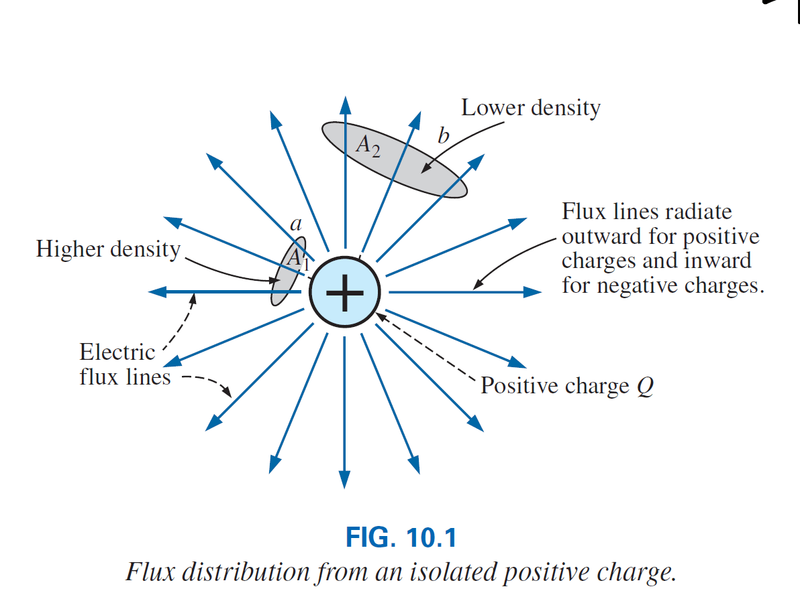

# El Capacitor

El **capacitor** al igual que la resitsencia es un dispositivo de dos terminales, sin embargo sus características son totalmente diferentes a las de una resistencia. De hecho, el capacitor muestra sus verdaderas características unicamente cuando *un cambio en el voltaje o corriente ocurre en la red.*

Por otro lado, toda la potencia entregada a un resistor es disipada en forma de calor, un capacitor ideal guarda la energia entregada de una forma que pueda ser devuelta al sistema nuevamente.

## El campo eléctrico

Considere el área alrededor de una particula cargada, en esta área existe una fuerza provocada por carga positiva o negativa en la particula, a esta fuerza le llamamos **campo électrico** .

Este campo lo respresentamos por **lineas de flujo eléctrico** las cuales se dibujan para indicar la fuerza de dicho campo eléctrico en cualquier punto alrededor del cuerpo cargado. Mientras mas densas las lineas de flujo, mayor es la intensidad del campo.

En la figura se puede observar que la densidad de flujo en el area *a* es mayor que en el area *b*.

Por definición la **intensidad del campo eléctrico** en un punto es la fuerza que actúa sobre una unidad de carga positiva en ese punto, es decir:

\begin{equation}
    \mathscr{E}=\frac{F}{Q}  
\end{equation} 

(newton/coulomb, N/C)

de la **ley de Coulomb**, para una carga de 1 //(C//) obtenemos