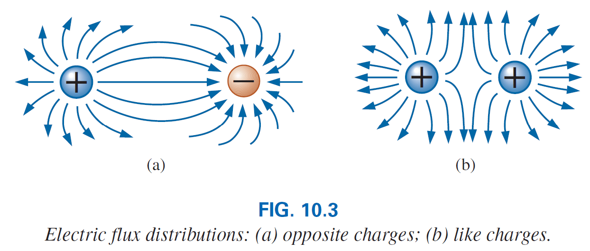
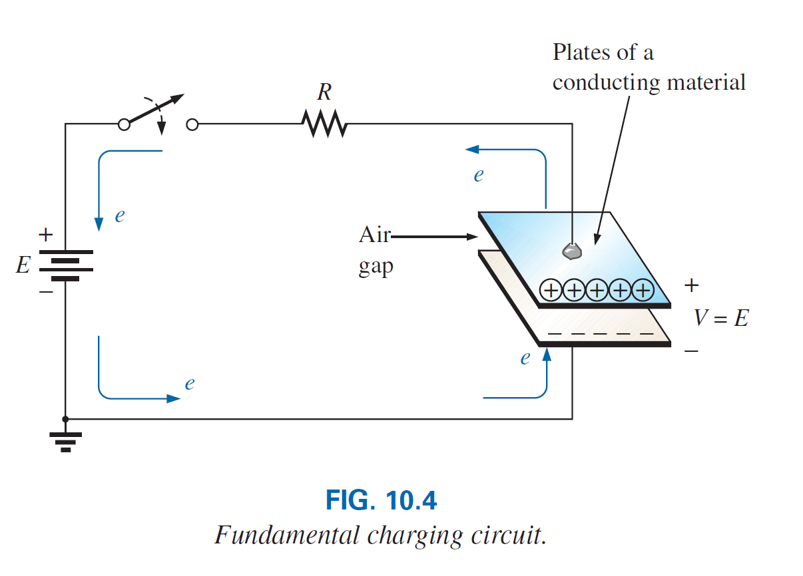

# El Capacitor

El **capacitor** al igual que la resitsencia es un dispositivo de dos terminales, sin embargo sus características son totalmente diferentes a las de una resistencia. De hecho, el capacitor muestra sus verdaderas características unicamente cuando *un cambio en el voltaje o corriente ocurre en la red.*

Por otro lado, toda la potencia entregada a un resistor es disipada en forma de calor, un capacitor ideal guarda la energia entregada de una forma que pueda ser devuelta al sistema nuevamente.

## El campo eléctrico

Considere el área alrededor de una particula cargada, en esta área existe una fuerza provocada por carga positiva o negativa en la particula, a esta fuerza le llamamos **campo électrico** .

Este campo lo respresentamos por **lineas de flujo eléctrico** las cuales se dibujan para indicar la fuerza de dicho campo eléctrico en cualquier punto alrededor del cuerpo cargado. Mientras mas densas las lineas de flujo, mayor es la intensidad del campo.

En la figura se puede observar que la densidad de flujo en el area *a* es mayor que en el area *b*.

Por definición la **intensidad del campo eléctrico** en un punto es la fuerza que actúa sobre una unidad de carga positiva en ese punto, es decir:

\begin{equation}
    \mathscr{E}=\frac{F}{Q}  
\end{equation} 

(newton/coulomb, N/C)

de la **ley de Coulomb**, para una carga de 1 \\(C\\) obtenemos:

\begin{equation}
    \mathscr{E}=\frac{kQ}{r^2}  
\end{equation} 

De la anterior ecuación podemos ver que mientras mas grande la carga, mayor la intensidad de campo eléctrico en una unidad de carga, sin embargo la distancia esta al cuadrado en el denominador, lo que significa que la intensidad del campo disminuye significativamente a medida que nos alejamos de la carga.

Para dos cargas de polaridades similares y diferentes, la distribución del flujo del campo eléctrico es según la siguiente grafica:

> Las lineas de flujo eléctrico siempre salen del elemento cargado positivamente hacia el cargado negativamente, siempre termnina perpendicular a la superficie el equipo cargado, y nunca se intersectan.
> 

## Capacitancia

Observe el siguente diagrama, dos placas paralelas de algun material como el aluminio se han conectado a traves de un interruptor y un resistor a una bateria. Si las placas paralelas estan inicialmente descargadas y el interruptor se deja abierto, no existe ninguna carga negativa o positiva en ninguna placa. 

Sin embargo, en el momento en que se cierra el interruptor, la placa superior atrae electrones a través del resistor hacia la terminal positiva de la bateria. Al principio habrá un exceso de corriente, limitado en su magnitud por la resistencia presente. Luego el flujo disminuira como podremos comprobar despues. Esta acción crea una carga positiva en la carga superior. La terminal negativa repele los electrones que pasan del conductor inferior hacia la placa inferior a la misma velocidad con que los atrae la terminal positiva. Esta transferencia de electrones prosigue hasta que la diferencia de voltaje a través de las placas paralelas es exactamente igual al voltaje de la batería. El resultado final es una carga neta positiva en la placa superior y una carga neta negativa en la placa inferior, muy similar en muchos aspectos a de las dos cargas aisladas de la figura anterior.

Este elemento, conceptualizado por dos placas paralelas separadas por un material aislante (en este caso el aire) se denomina ***capacitor***. *La capacitancia* es una medida de la capacidad de un capacitor para almacenar cargas en sus placas; en otras palabras, su capacidad de almacenamiento.

> Un capacitor tiene una capacitancia de un *farad* si se deposita 1 coulomb de carga en las placas mediante una diferencia de voltaje de 1 volt a través de las placas.

\begin{equation}
    C=\frac{Q}{V}  
\end{equation} 

C = farads (F), Q = coulombs (C), V = volts (V)

> Mientras mas grande la capacitancia de un capacitor, mayor la cantidad de carga almacenada entre sus placas, para el mismo voltaje aplicado.

