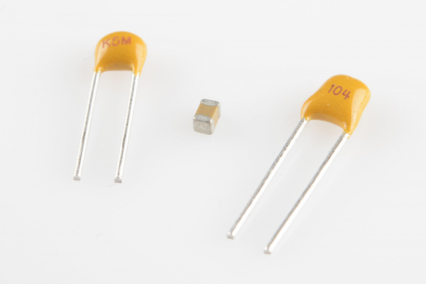
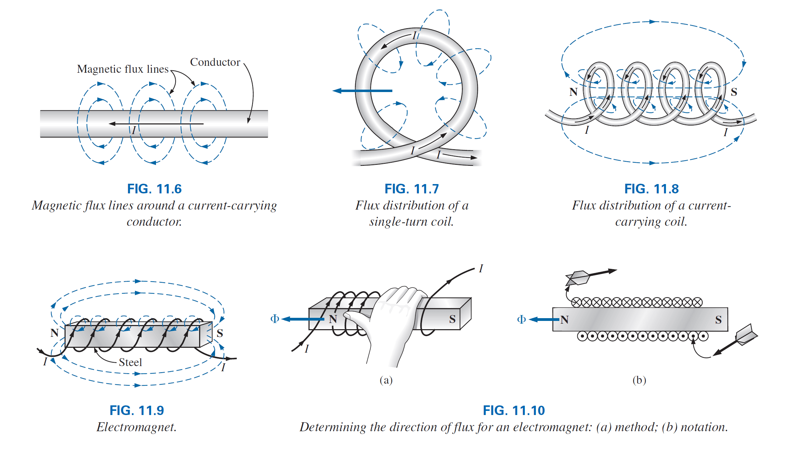

# El Capacitor
Un capacitor o también conocido como condensador es un dispositivo capaz de almacenar  energía a través de campo eléctrico. Este se clasifica dentro de los componentes pasivos ya que no tiene la capacidad de amplificar o cortar el flujo eléctrico

Los capacitores se utilizan principalmente como filtros de corriente continua, ya que evitan cambios bruscos y ruidos en las señales debido a su funcionamiento.

## El campo eléctrico

Considere el área alrededor de una particula cargada, en esta área existe una fuerza provocada por carga positiva o negativa en la particula, a esta fuerza le llamamos **campo électrico** .

Este campo lo respresentamos por **lineas de flujo eléctrico** las cuales se dibujan para indicar la fuerza de dicho campo eléctrico en cualquier punto alrededor del cuerpo cargado. Mientras mas densas las lineas de flujo, mayor es la intensidad del campo.

En la figura se puede observar que la densidad de flujo en el area *a* es mayor que en el area *b*.

Por definición la **intensidad del campo eléctrico** en un punto es la fuerza que actúa sobre una unidad de carga positiva en ese punto, es decir:

\begin{equation}
    \mathscr{E}=\frac{F}{Q}  
\end{equation} 

(newton/coulomb, N/C)

de la **ley de Coulomb**, para una carga de 1 \\(C\\) obtenemos:

\begin{equation}
    \mathscr{E}=\frac{kQ}{r^2}  
\end{equation} 

De la anterior ecuación podemos ver que mientras mas grande la carga, mayor la intensidad de campo eléctrico en una unidad de carga, sin embargo la distancia esta al cuadrado en el denominador, lo que significa que la intensidad del campo disminuye significativamente a medida que nos alejamos de la carga.

Para dos cargas de polaridades similares y diferentes, la distribución del flujo del campo eléctrico es según la siguiente grafica:

> Las lineas de flujo eléctrico siempre salen del elemento cargado positivamente hacia el cargado negativamente, siempre termnina perpendicular a la superficie el equipo cargado, y nunca se intersectan.
> 

## Funcionamiento de un capacitor

Observe el siguente diagrama, dos placas paralelas de algun material como el aluminio se han conectado a traves de un interruptor y un resistor a una bateria. Si las placas paralelas estan inicialmente descargadas y el interruptor se deja abierto, no existe ninguna carga negativa o positiva en ninguna placa. 

Sin embargo, en el momento en que se cierra el interruptor, la placa superior atrae electrones a través del resistor hacia la terminal positiva de la bateria. 

Al principio habrá un exceso de corriente, limitado en su magnitud por la resistencia presente. Luego el flujo disminuira como podremos comprobar despues. Esta acción crea una carga positiva en la carga superior. La terminal negativa repele los electrones que pasan del conductor inferior hacia la placa inferior a la misma velocidad con que los atrae la terminal positiva. 

Esta transferencia de electrones prosigue hasta que la diferencia de voltaje a través de las placas paralelas es exactamente igual al voltaje de la batería. El resultado final es una carga neta positiva en la placa superior y una carga neta negativa en la placa inferior.

Es importante hacer notar que el flujo entero de carga occure entre la bateria y el resistor, no a traves de la región enmedio de las dos placas. En todo sentido de la definición, existe un circuito abierto entre las placas.  

Este elemento, formado por dos placas paralelas separadas por un material aislante (en este caso el aire) se denomina ***capacitor***. 

## La capacitancia

*La capacitancia* es una medida de la capacidad de un capacitor para almacenar cargas en sus placas; en otras palabras, su capacidad de almacenamiento.

> Un capacitor tiene una capacitancia de un *farad* si se deposita 1 coulomb de carga en las placas mediante una diferencia de voltaje de 1 volt a través de las placas.

\begin{equation}
    C=\frac{Q}{V}  
\end{equation} 

C = farads (F), Q = coulombs (C), V = volts (V)

Mientras mas grande la capacitancia de un capacitor, mayor la cantidad de carga almacenada entre sus placas, para el mismo voltaje aplicado.

## Dieléctrico

Al agregar un material dieléctrico entre las placas de un capacitor, este aumenta su capacitancia.

## Tipos de capacitores

**Ceramicos**

**De aluminio y Tantalio**

**De polyester**

## Ejemplos de aplicación

**Capacitores de desacoplamiento (Bypass)**

**Filtrado de una fuente de poder**
Los rectificadores de diodos se utilizan para convertir la corriente y voltaje AC que viene del tomacorriente hacia voltaje DC. Pero los diodos por si solos no pueden convertir la AC a una señal limpia de DC, se necesita del capacitor. Al apadir un capacitor en paralelo con el puente rectificador, la sepal como esta:

se convierte en esta:

Entre las aplicaciones que tienen los capacitores, se encuentra:

**Filtrado de señales**

# El Inductor

## El campo magnetico

Un campo magnético existe en la región que rodea un magneto o imán permanente, este puede ser representado por lineas de flujo magnético similiar a las lineas de flujo eléctrico. Sin embargo, las lineas de flujo magnético no se originan ni terminan en ningun punto, sino existen en blucles continuos.

Si se coloca un material no magnético, como vidrio o cobre, en las rutas de flujo que rodean a un imán permanente, se produce un cambio casi imperceptible en la distribución del flujo (Fig. 11.4). Sin embargo, si se coloca un material magnético, como el hierro blando, en la ruta del flujo, las líneas de flujo pasan a través del hierro suave en lugar del aire circundante porque las líneas de flujo pasan con mayor facilidad a través de materiales magnéticos que a través del aire. Este principio se utiliza para proteger elementos e instrumentos eléctricos sensibles que pueden verse afectados por campos magnéticos dispersos (Fig. 11.5).

Un campo magnético (representado por líneas de flujo magnético concéntrico, como en la figura 11.6) está presente alrededor de cada cable que lleva una corriente eléctrica. La dirección de las líneas de flujo magnético se puede encontrar simplemente colocando el pulgar de la mano derecha en la dirección del flujo de corriente convencional y observando la dirección de los dedos. (Este método se denomina comúnmente la regla de la mano derecha). Si el conductor se enrolla en una bobina de una sola vuelta (Fig. 11.7), el flujo resultante fluye en una dirección común a través del centro de la bobina. Una bobina de más de una vuelta produce un campo magnético que existe en un camino continuo a través y alrededor de la bobina (Fig. 11.8).

La distribución de flujo de la bobina es bastante similar a la del imán permanente. Las líneas de flujo que salen de la bobina desde la izquierda y entran a la derecha simulan un polo norte y un polo sur, respectivamente. La principal diferencia entre las dos distribuciones de flujo es que las líneas de flujo están más concentradas para el imán permanente que para la bobina.

Además, dado que la intensidad de un campo magnético está determinada por la densidad de las líneas de flujo, la bobina tiene una intensidad de campo más débil.

La intensidad de campo de la bobina se puede aumentar efectivamente al colocar ciertos materiales, como hierro, acero o cobalto, dentro de la bobina para aumentar la densidad de flujo dentro de la bobina.

Al aumentar la intensidad de campo con la adición del núcleo, hemos ideado un electroimán (Fig. 11.9) que no solo tiene todas las propiedades de un imán permanente, sino que también tiene una intensidad de campo que se puede variar cambiando uno de los valores de los componentes (actual, turnos, etc.)

Por supuesto, la corriente debe pasar a través de la bobina del electroimán para que se desarrolle el flujo magnético, mientras que no hay necesidad de la bobina o la corriente en el imán permanente.

La dirección de las líneas de flujo se puede determinar para el electroimán (o en cualquier núcleo con una envoltura de giros) colocando los dedos de su mano derecha en la dirección del flujo de corriente alrededor del núcleo. Luego, el pulgar apunta en la dirección del polo norte del flujo magnético inducido, como se muestra en la figura 11.10 (a).

Una sección transversal del mismo electroimán se encuentra en la Fig. 11.10 (b) para introducir la convención para direcciones perpendiculares a la página. La cruz y el punto se refieren a la cola y la punta de la flecha, respectivamente.

En el sistema de unidades SI, el flujo magnético se mide en **webers (Wb)**, y la cantidad de líneas de flujo por unidad de área, llamada densidad de flujo, se indica con la letra B mayúscula y se mide en **teslas (T)**

## La Inductancia

En la sección anterior, aprendimos que enviar una corriente a través de una bobina de cable, con o sin núcleo, establece un campo magnético a través y alrededor de la unidad. Este componente, de construcción bastante simple (ver Fig. 11.16), se llama **inductor** (a menudo denominado bobina). Su nivel de inductancia determina la intensidad del campo magnético alrededor de la bobina debido a una corriente aplicada. Cuanto mayor sea el nivel de inductancia, mayor será la fuerza del campo magnético. En total, por lo tanto,

> los inductores están diseñados para establecer un campo magnético fuerte que une el
> unidad, mientras que los condensadores están diseñados para establecer un campo eléctrico fuerte entre los platos

La inductancia se mide en henries (H), sn embargo, así como el faradio es demasiado grande
unidad para la mayoría de las aplicaciones, la mayoría de los inductores son del rango milihenrio (mH) o microhenrio (mH).

Previamente, 1 faradio se definió como un nivel de capacitancia que resultar en 1 coulomb de carga en las placas debido a la aplicación de 1 voltio a través de las placas. 

> Para inductores, 1 henry es el nivel de inductancia que establecerá un voltaje de 1 voltio a través de la bobina debido a un cambio en la corriente de 1 A / s a través de la bobina.

## Simbolo

## Tipos de Inductores

Los inductores, como los condensadores y las resistencias, se pueden clasificar de forma general como fijos o variables.

**Fijos**

**Variables**

## Aplicaciones de una bobina / inductor

### Filtros
Los inductores se usan ampliamente con condensadores y resistencias para crear filtros para circuitos analógicos y en el procesamiento de señales. Solo, un inductor funciona como un filtro de paso bajo, ya que la impedancia de un inductor aumenta a medida que aumenta la frecuencia de una señal. Cuando se combina con un condensador, cuya impedancia disminuye a medida que aumenta la frecuencia de una señal, resulta un filtro con muesca que solo permite que pase un cierto rango de frecuencia. Al combinar condensadores, inductores y resistencias, las topologías de filtro avanzadas admiten una variedad de aplicaciones. Los filtros se usan en la mayoría de los dispositivos electrónicos, aunque los condensadores se usan a menudo en lugar de los inductores cuando es posible, ya que son más pequeños y más baratos.

### Sensores
Los sensores sin contacto son apreciados por su confiabilidad y facilidad de operación. Los inductores detectan campos magnéticos o la presencia de material magnéticamente permeable desde la distancia. Los sensores inductivos se encuentran en el corazón de casi todas las intersecciones con un semáforo que detecta la cantidad de tráfico y ajusta la señal en consecuencia. Estos sensores funcionan excepcionalmente bien para automóviles y camiones, pero algunas motocicletas y otros vehículos no tienen suficiente firma para ser detectados por los sensores sin un pequeño impulso adicional al agregar un imán h3 en la parte inferior del vehículo.

Los sensores inductivos están limitados de dos maneras principales: el objeto a detectar debe ser magnético e inducir una corriente en el sensor o el sensor debe estar encendido para detectar la presencia de materiales que interactúan con un campo magnético. Esto limita las aplicaciones de los sensores inductivos y tiene una gran influencia en los diseños que los utilizan.

### Transformadores
La combinación de inductores que tienen un camino magnético compartido forma un transformador. El transformador es un componente fundamental de las redes eléctricas nacionales y también se encuentra en muchas fuentes de alimentación para aumentar o disminuir los voltajes al nivel deseado. Dado que los campos magnéticos se crean por un cambio en la corriente, cuanto más rápido cambie la corriente (aumento de frecuencia), más efectivo será el funcionamiento de un transformador. Por supuesto, a medida que aumenta la frecuencia de la entrada, la impedancia del inductor comienza a limitar la efectividad de un transformador. Prácticamente, los transformadores basados ​​en inductancia están limitados a decenas de kHz, generalmente más bajos. El beneficio de una frecuencia de operación más alta es un transformador más pequeño y liviano que entrega la misma carga.

### Motores
Normalmente los inductores están en una posición fija y no se les permite moverse para alinearse con ningún campo magnético cercano. Los motores inductivos aprovechan la fuerza magnética aplicada a los inductores para convertir la energía eléctrica en energía mecánica. Los motores inductivos están diseñados para crear un campo magnético giratorio a tiempo con una entrada de CA. Dado que la velocidad de rotación está controlada por la frecuencia de entrada, los motores de inducción a menudo se utilizan en aplicaciones de velocidad fija que pueden alimentarse directamente de 50/60 Hz de potencia de red. La mayor ventaja de los motores inductivos sobre otros diseños es que no se requiere contacto eléctrico entre el rotor y el motor, lo que hace que los motores inductivos sean muy robustos y confiables.

