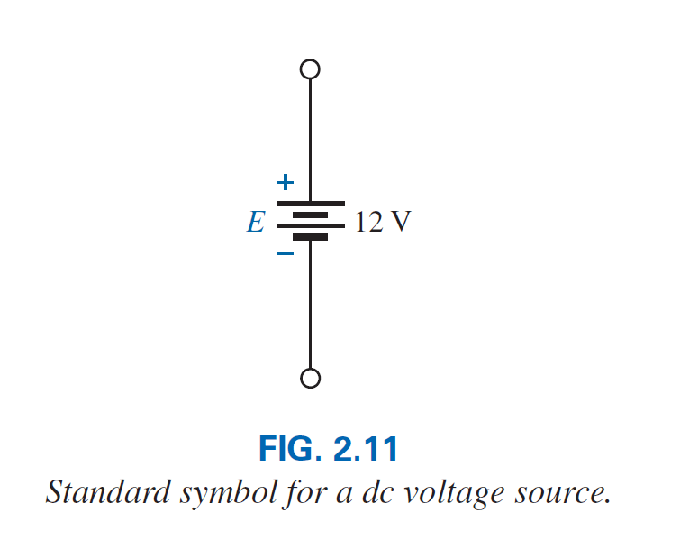

---
# Feel free to add content and custom Front Matter to this file.
# To modify the layout, see https://jekyllrb.com/docs/themes/#overriding-theme-defaults

layout: post
title: "Carga, Voltaje y Corriente"
date:   2019-11-24 22:02:22 -0600
permalink: /carga-voltaje-corriente/
categories: apuntes_curso
mathjax : true
---

# La Carga eléctrica

> En la física moderna, la carga eléctrica es una propiedad intrínseca de la materia responsable de producir las interacciones electrostáticas.

En la actualidad no se sabe qué es o por qué se origina dicha carga, lo que si se conoce es que la **materia ordinaria se compone de átomos**, para poder comprender que es la carga eléctrica, debemos estudiar como se componen dichos átomos.

## El atomo y su estructura

El más sencillo de los atomos es el de hidrógeno, formado por dos partículas básicas, el **protón** y el **electrón**. 

El **protón** se encuentra en el **núcleo** del atómo y posee una carga positiva, el **electrón** rodea al nucleo en una orbita, y transporta una carga negatíva de la misma magnitud que  la carga del **protón**.

Todos los demas elementos tambien contienen ***neutrones*** en su nucleo, los cuales no tienen ninguna carga eléctrica. Por ejemplo el átomo de helio, que tiene dos neutrones, ademas de dos protones y dos electrónes, como se muestra en la figura anterior.

> La estructura atómica de cualquier átomo estable tiene igual número de electrones y de protones.
>

Dependiente del elemento, los atomos tienen varios electrones alrededor del nucleo en 
en orbitas concentricas, llamadas capas. La primera capa, la cual es la mas cercana al núcleo, puede tener unicamente dos electrones. Si el átomo tiene tres electrónes, el electrón extra debe ir en la siguiente capa. 

El numero de electrones que cada capa puede alojar, esta determinado por \\(2n^2\\) donde \\(n\\) es el número de capa. Adicionalmente cada capa esta dividida en subcapas, donde el número de electrones está limitado a 2, 6, 10 y 14, en ese orden según se alejan del núcleo.

El **Cobre** es el metal mas utilizado para conducir electricidad. Si examinamos su estructura atómica, podemos compreder porque es tan utilizado. Su átomo tiene 29 electrónes en orbitas alrededor del nucleo, y el electron No. 29 aparece orbitando solo en la capa numero 4.

Se sabe que los atomos con las capas de electrónes llenas son mas estables. Y aquellos atomos cuyas capas mas externas estan ocupados por un pequeño porcentaje de electrones, son inestables y volatiles.

Tambien se sabe, que las cargas opuestas se atraen entre ellas, y las cargas iguales se repelen. De hecho esta fuerza de atracción es inversamente proporcianal a la distancia entre dichas cargas, y esta dada por la **ley de Coulomb**:

\begin{equation}
    F=k\frac{Q_1Q_2}{r^2}  
\end{equation} 

donde \\(F=\\) esta dado en newtons (\\(N\\)), \\(k=\\) una constante \\(=9.0 \times 10^{9} N\cdot m^{2}/C^{2}\\), \\(Q_1\\) y \\(Q_2\\) son cargas en coulombs, y \\(r\\) es la distancia entre las dos cargas en metros.

Como se puede notar de la anterior formula, mientras mas grande es la distancia entre el nucleo de un atomo y un electrón, menor es la  fuerza de atracción entre ellos. Es por eso que el electrón No. 29 del átomo de cobre, tiene muy poca fuerza de atracción con los protones de su nucleo, como resultado, con una pequeña fuerza producida por una fuente externa este pude "dejar" el atómo padre. Esto lo que se le llama un **electrón libre.**

> En un cubo de 1 pulgada de cobre, a temperatura ambiente, hay aproximadamente \\(1.4\times10^{24}\\) electrones libres. 
> 

Otros metales que tienen las mismas propiedades que el cobre, pero en diferente grado son, la plata, el oro y el aluminio, asi como algunos metales raros como el tungsteno.

# El Voltaje

Al separar el electrón #29 del resto de la estructura del átomo, podemos ver que se forma una región con una carga neta positiva (el atomo con un proton extra) y una región negativa (el electron libre separado del atomo padre).

A la región positiva le llamamos **ión positivo**. Un *ion positivo* es un átomo que esta cargado positivamente, ya que tiene mas protones que electrónes en su estructura.

Esta separación de cargas para crear regiones positivas y negativas, es lo que precisamente ocurre en una bateria. A travéz de una reacción quimica, un alta concentración de cargas positivas (iones positivos) es establecida en una terminal de la bateria, y la misma cantidad de carga negativa se establece en la terminal negativa de la batería.

> Cualquier fuente de voltaje se establece simplemente creando una separación de cargas positivas y negativas

En la sección anterior se introdujo el **coulomb**, el cual nos sirve para medir la cantidad de carga, ya sea positiva o negativa. Esta definido que 1 \\(coulomb (C)\\) de carga, es igual a la carga que producen \\(6.42\times10^{18}\\) electrones.

O dicho de otra forma, un electrón posee una carga de \\(6.24\times10^{-19}\\) coulombs.

> 1 \\(coulomb (C)\\) = \\(6.42\times10^{18} e\\)
> 
> donde \\(e\\) = carga puntual

Si tomamos una carga negativa de un **coulomb** cercano a la superficie de una carga positiva y lo movemos hacia una carga negativa, se debe de gastar energía para poder contrarestar las fuerzas de repulsíon de la carga negativa mas grande, así como las fuerzas de atracción de la carga positiva. De acuerdo con la siguiente figura, en este proceso de mover la carga de *a* a *b*:

> Si un total de **1 joule** (J) de energía es utilizado para mover una carga negativa de **1 coulomb** (C), se dice que existe una diferencia de **1 volt** (V) entre los dos puntos.
> 

Lo cual se expresa en la siguiente ecuación:

> 

> \begin{equation}
>     V=\frac{W}{Q}  
> \end{equation} 
> 

> donde, V = volts(V), W = joules (J), Q = coulombs (C).

A traves de manipulaciones algebráicas obtenemos:

> 

> \begin{equation}
>     W={Q}{V}  
> \end{equation} 
> 

> (joules ,J)
y
> 

> \begin{equation}
>     Q=\frac{W}{V}  
> \end{equation} 
> 

> (coulombs,C)

A la diferencia de voltaje entre dos puntos, tambien se le conoce como **diferencia de potencial.**

## La Corriente

Generalmente se confunden los terminos corriente y voltaje, o se usan de forma intercambiada, debemos recordar que:

> El voltaje aplicado es el mecanismo inicial - la corriente es la reacción a ese voltaje aplicado
> 

En un pedazo de cable, si cortamos el cable en un plano imaginario perpendicular, produciendo una sección circular, ségún se muestra en la figura, existen tanto electrones libres que cruzan dicho plano en ambas direcciones. Sin embargo en cualquier instante de tiempo, la misma cantidad de electrones que cruzan en una dirección, la cruzan en la dirección opuesta, por lo que el flujo de electrones es cero.

Para que los electrónes fluyan en una misma dirección debemos aplicar un voltaje a travezdel cable para forzar a los electrones a moverse hacia la terminal negativa de la bateria, como se puede ver en la figura.

En el instante que el cable se colocaentre las terminales de la batería, los electrónes libres se mueven inmediatamente hacia la terminal positiva, mientras estos electrones se mueven, la bateria actua como una fuente constante de electrones para mantener la carga fluyendo.

Para llevar el proceso un paso mas, considere la siguiente figura, donde un cable de cobre a sido utilizado para conectar una bombilla con una bateria. En el instante que la conexíon es realizada, los electrones libres con carga negativa fluyen hacia la terminal positiva, mientras que los iones positivos en la terminal positiva, simplemente oscilan en una posición fija promedio. El flujo de cargas (los electrones) a traves de la bombilla, calienta el filamento por motivo de la fricción, al punto que este brilla al rojo-vivo, produciendo la luz. En total, por lo tanto, un voltaje aplicado establecio un flujo de electrónes en una misma dirección, lo que conocemos como corriente eléctrica.

> Si  \\(6.242\times10^{18}\\) electrones (1 coulomb), pasan a travéz del plano imaginario de la figura en 1 segundo, el flujo de carga, la corriente, se dice que es de 1 ampere (A)

La unidad para medir la corriente es el **amperio**. Utilizando el coulomb como unidad de carga, la corriente en amperios puede determinarse con la siguiente ecuación:

> 

> \begin{equation}
>     I=\frac{Q}{t}  
> \end{equation} 
> 

> 
> donde, I = amperios(A), Q = coulombs (C), t = tiempo (s).
> 

La letra *I* se escogio por la palabra usada en frances "intensité".

Mediante manipulaciónes algebraicas tenemos:

> 

> \begin{equation}
>     Q={I}{t}  
> \end{equation} 
> 

> (coulombs, C)
y
> 

> \begin{equation}
>     t=\frac{Q}{I}  
> \end{equation} 
> 

> (segundos, s)

En resumen por lo tanto:

> **El voltaje aplicado (diferencia de potencial) en un sistema eléctrico/electrónico es la presión para poner en acción al sistema, y la corriente es la reacción a dicha presion.**

### Fuentes de voltaje

El termino **dc** es la abreviación de *"corriente directa"*, lo que significa que la corriente fluje en una sola dirección.

La siguiente gráfica muestra el simbolo utilizado para las fuentes de voltaje de dc. Observe que la longitud de las barras en cada extremo define la polaridad de la fuente. La barra mas larga representa el lado positivo, y la barra corta el lado negativo. Generalmente se utiliza la letra E para denotar una *fuente de voltaje*. Viene del echo que:

> Una fuerza electromotriz (emf) es una fuerza que establece un flujo de carga (o corriente) en un sistema debido a la aplicación de una diferencia de potencial.

## Uso del Amperimetro y del Voltimetro

Es importante poder medir los niveles de corriente y voltaje en un sistema eléctrico en funcionamiento. Como su nombre lo indica los Amperimetros son utilizados para medir niveles de corriente, mientras los Voltimetros son utilizados para medir la diferencia de potencial entre dos puntos.

La diferencia de potencias puede medirse entre dos puntos simplemente conoctando los cables del medidor a través de los dos puntos. La punta positiva se debe de conectar al punto con mayor nivel de potencial, mientras la otro extremo, al punto con menor nivel de potencial, para obtener una medición positiva. La conexión a la inversa nos daria una medición negativa (menor a cero).

Debido a que los Amperimetros miden la taza del flujo de cargas, el medidor debe ser colocado en la red por la cual la carga fluye. La unica forma de hacer esto es abriendo el camino por medio del cual la corriente va ser medida y colocando el medidor entre estos sos puntos. Por lo tanto se debe desconectar el circuito. Como lo muestra la figura.

Existen instrumentos para medir solo voltaje o solo corriente, sin embargo hoy en dia lo mas común es utilizar un instrumento que mide ambos valores, ademas de resistencia y otros parametros, llamado ***Multimetro Digital***

