# Las Resistencias

Cuando colocamos un voltaje a travez de un cable o un circuito se produce un flujo de carga o corriente a travez del cable o circuito. La pregunta que surge es, ¿Qué determina el nivel de corriente que resulta cuando un voltaje en particular es aplicado? La respuesta está en el hecho que exite una oposición al flujo de la carga en el sistema que depende de los componentes del circuito. Esta oposición al flujo de carga a travéz de un circuito se llama  **resistencia**, y tiene la unidad de **ohms**, y utiliza la letra griega omega \\(\Omega\\).

El simbolo eléctrico de una resistencia se muestra en la siguiente figura:

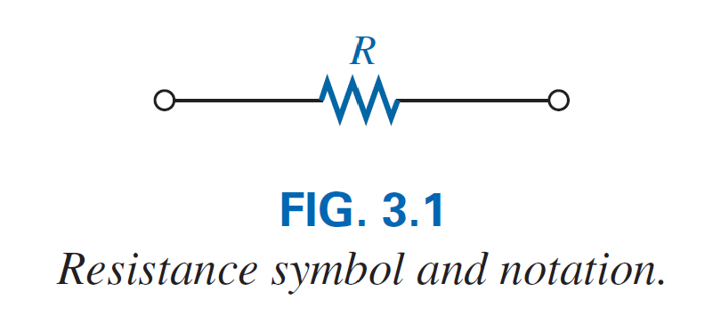

La oposición, debido principalmente a la colisión y fricción entre los electrones libres y otros electroes, iones y atomos a lo largo de la ruta del movimiento, convierte la energía eléctrica suministrada en **calor** el cuál eleva la temperatura del componente eléctrico y el medio que lo rodea.

## Resistencia de los cables circulares

La resistencia de cualquier material se debe a cuatro factores principales:

1. Material

2. Longitud
3. Área transversal
4. Temperatura del material

Como se vio anteriormente, la estructura atómica determina que tan facil es para un electrón libre pasar a travéz de un material. Mientras mas largo el camino por el cual el electrón tiene que pasar, mas grande es el grado de resistencia. Los electrónes libres pasan mas fácil a travéz de conductores con un área transversal mayor. Adicionalmente, mientras mayor la temperatura de un material conductivo, mayor es la vibración interna de la estructura atómica que forma el material, y más dificil es para los electrónes encontrar un camino por el material..

Los primeros trés elementos se relaciónan con la siguente ecuación básica de la resistencia:

\begin{equation}
    R=\rho\frac{l}{A}  
\end{equation} 

\\( \rho\\) = CM-\\( \Omega\\)/ft a \\( 20^°C\\)

donde cada componente de la ecuación corresponde a la sig. figura:

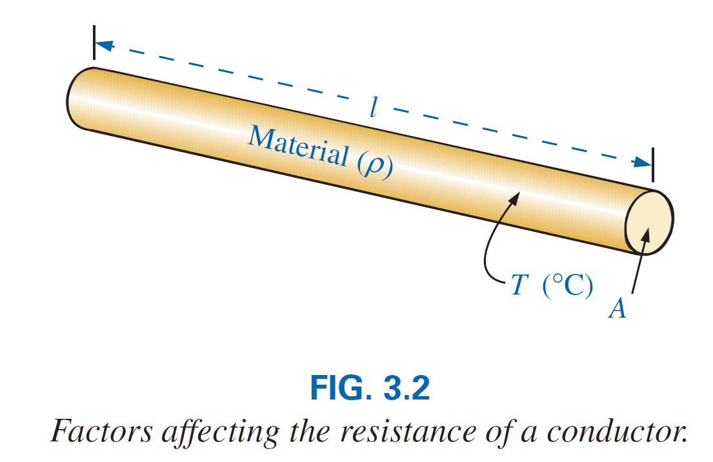

El material es identificado por un factor llamado **resistividad**, el cual usa la letra Griega *rho* (\\( \rho\\)) como simbolo y es medido en CM-\\( \Omega\\)/ft. Su valor a temperatura de \\( 20^°C\\) se muestra en la siguiente tabla:

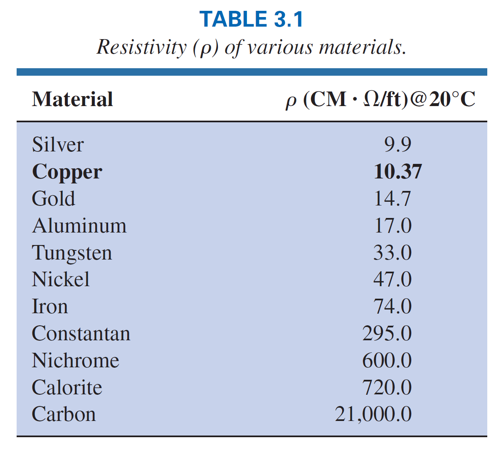

De lo anterior podemos concluir que:

> Mientras mayor es la resistividad, mayor la resistencia de un conductor.

> Mientras mas largo el conductor, mayor su resistencia.
> 

> Mientras más grande el área de un conductor, menor sus resistencia.

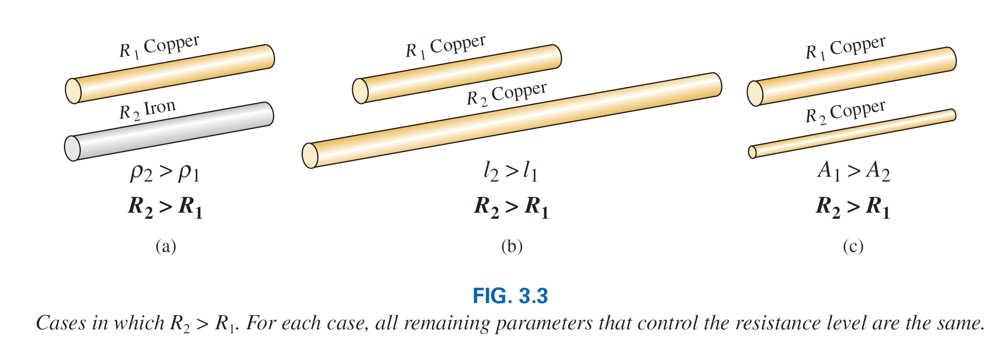

## Tipos de Resistores

Existen muchos tipos de resistores, sin embargo todos se clasifican en dos grupos: resistores de valor fijo y resistores variables:

### Resistores de valor fijo

Diferentes tipos de resistores.
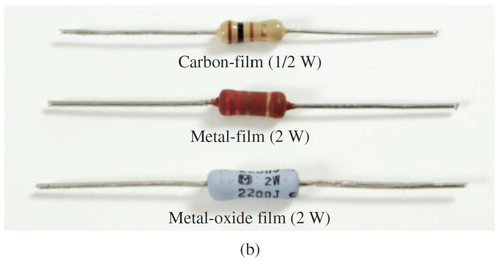

Construccion de resistores
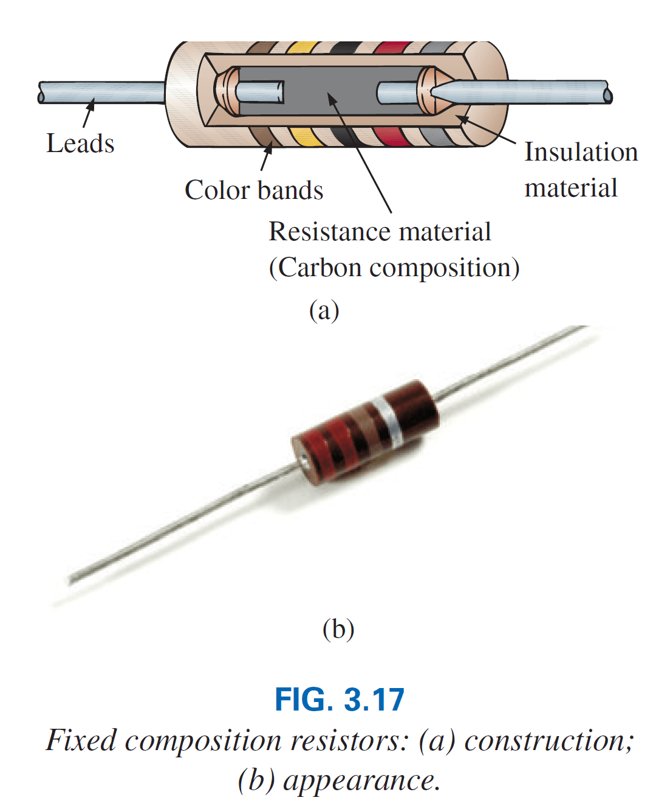

Generalmente el tamaño de un resistor incrementa según su valor de potencia o wattage.

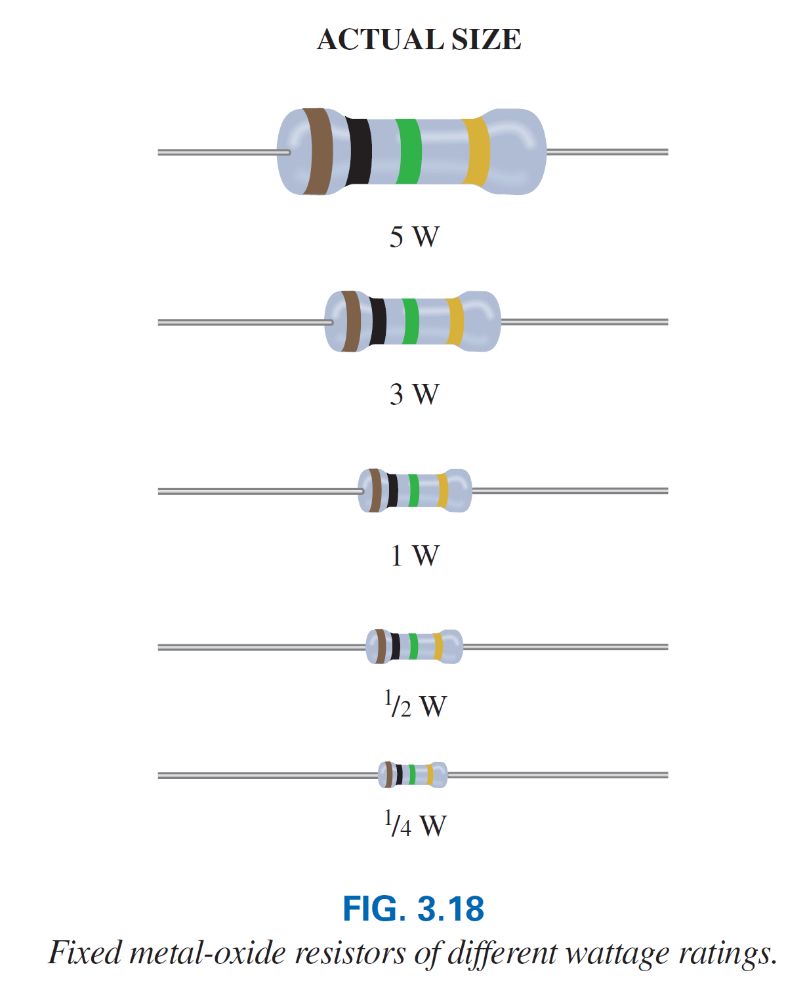

Varios tipos de resistencias de valor fijo

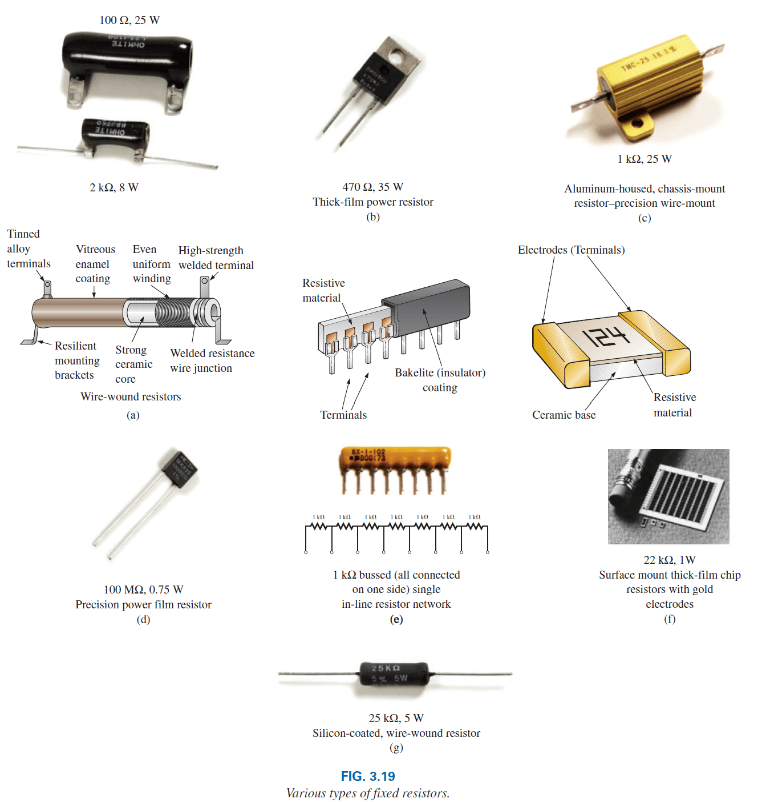

### Resistores Variables

Los resistores variables, como su nombre lo implica, tienen una resistencia que puede variar girando una perilla, un tornillo, o cualquier elemento según la aplicacion. Pueden tener dos o tres terminales, la mayoria ttienee tres terminales. Si el dispositivo es utilizado como una resistencia variable, es llamado **reostato**. Si el dispositivo es utilizado apra controlar un nivel de potencias, se le llama **potenciómetro.**.

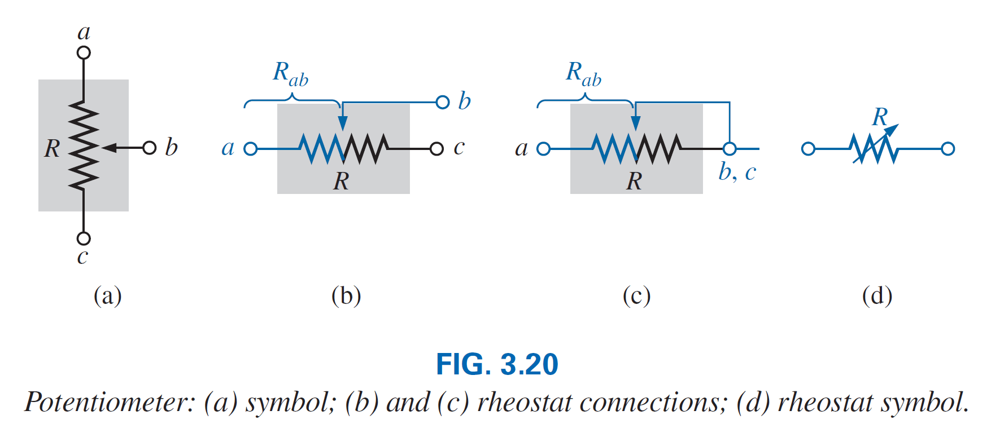

La resistencia entre las terminales exteriore a y c de la figura es siempre fija, al valor maximo del potenciometro, independiente de la posición del brazo.

La resistencia entre el brazo y cualquier terminal exterior puede variar desde un minimo 0 hasta el valor maximo del potenciometro.

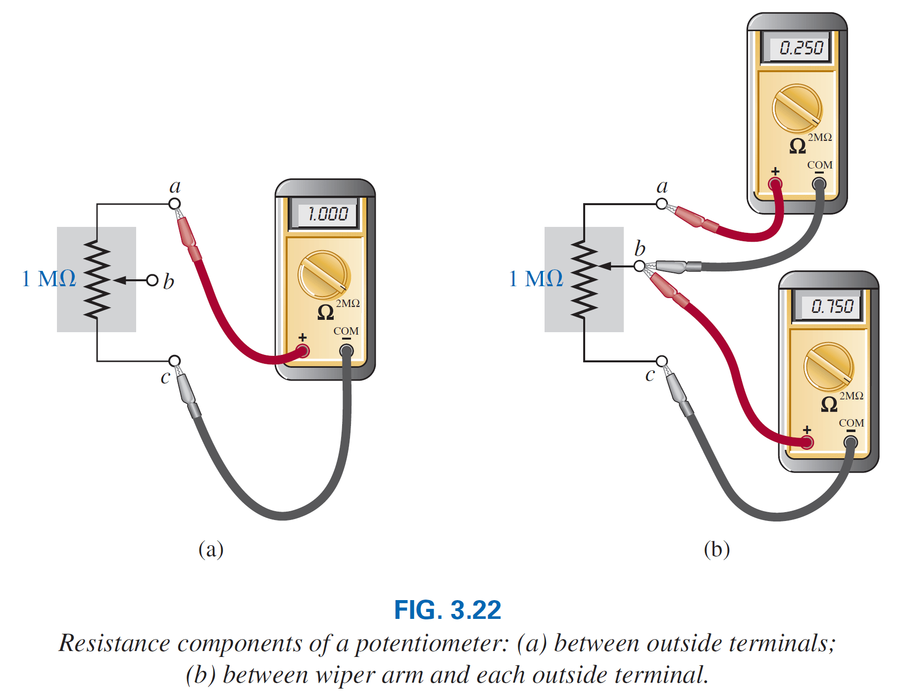

## Codigo de colores y valores estandares de los resistores

Para identificar el valor de las resistencias utilizamos un **código de colores**, el cual puede ser de 4, 5 o hasta 6 bandas. 

Por ejemplo, para el sistema de 4 bandas, siempre se debe leer desde el extremo que tiene la banda mas cercana, como se muestra en la figura.

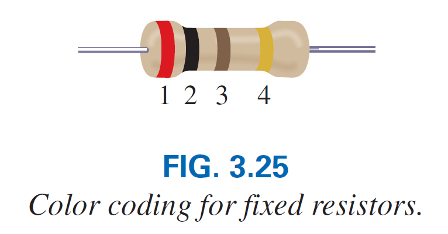

Las primeras dos bandas representan el primero y segundo dígito respectivamente, que definen el valor numérico de la resistencia

La tercera banda determina el multiplicador de la potencia de diez para el pimero y segundo octeto.

La cuarta banda indica la tolerancia del fabricante, lo cual indica que tan precisa fue hecha la resistencia. Si la cuarta banda no está, se puede asumir una tolerancia del 20%.

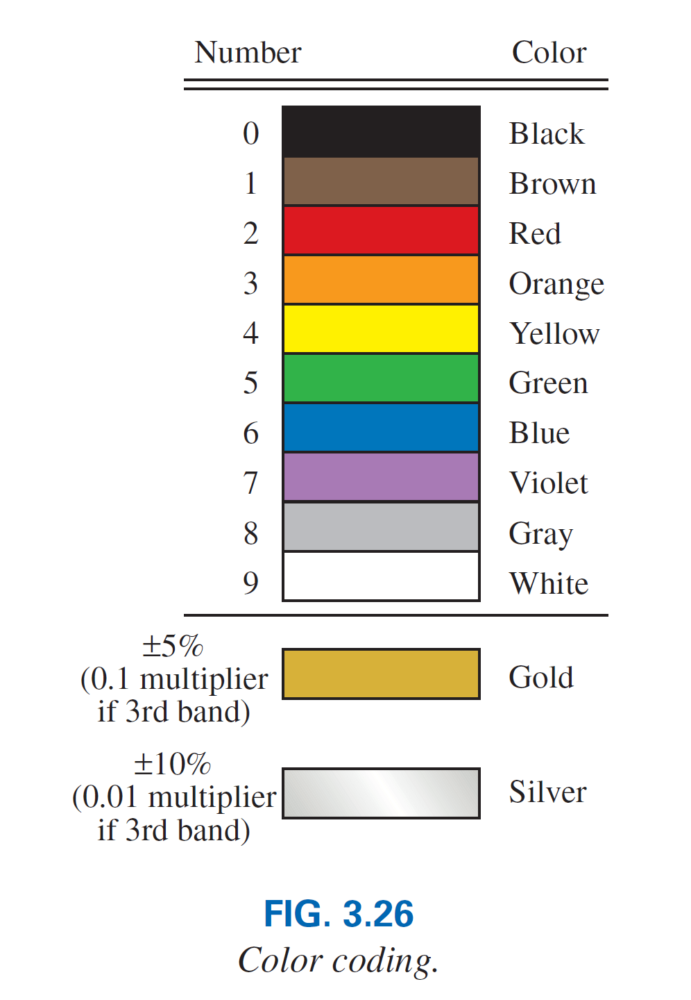

Valores comerciales de los resistores

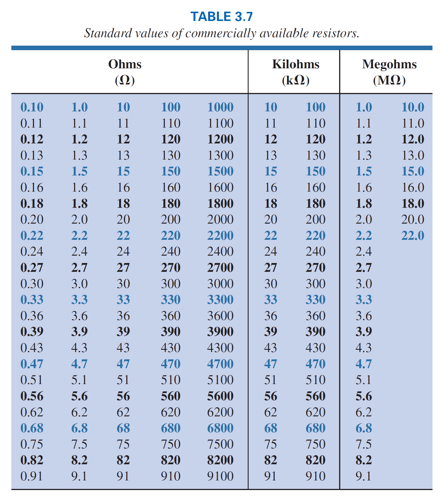

## Ohmetros

El ohmetro se utiliza para medir la resistencia en los siguientes casos

1. Medir la resistencia de elementos individuales o combinados
2. Detectar circuitos abierts (alta resistencia) o corto-circuitos (baja resistencia)
3. Verificar la continuidad de conexiones e identificar pares en cables multipar.
4. Probar algunos elementos semiconductores.

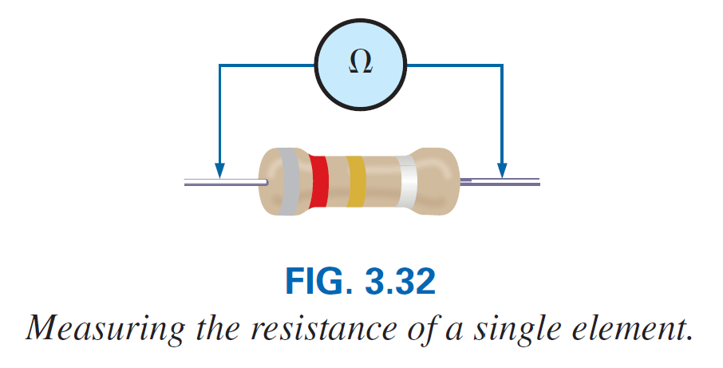

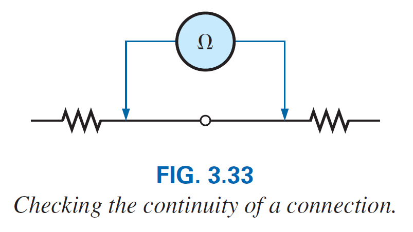

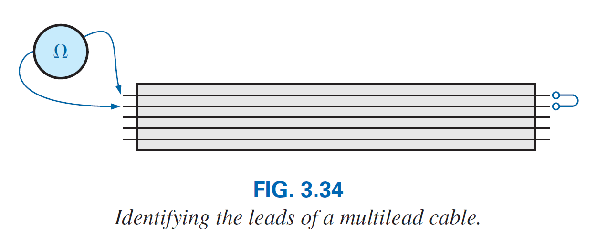

> Nunca intente medir la resistencia en un circuito energizado

> Nunca guarde un multimetro en modo de ohmetro

# La Ley de Ohm

En todo sistema físico tenemos:

\begin{equation}
    Efecto=\frac{Causa}{Oposicion}  
\end{equation} 

Como vimos anteriormente, en electricidad, el efecto que queremos establecer el el *flujo de cargas,* es decir, la *corriente*. La *diferencia de potencial*, o voltaje entre dos puntos es la *causa* ("presión"), y la oposición es la *resistencia* encontrada. Al sustitiur estos terminos en la ecuación anterior obtenemos

\begin{equation}
    Corriente=\frac{diferencia de potencial}{resistencia}  
\end{equation} 

o

\begin{equation}
    I=\frac{E}{R}  
\end{equation} 

A la ultima ecuación se le conoce como **Ley de Ohm** y es una de las leyes mas importantes de la electricidad y la electrónica.

Con algunas manipulaciones matemáticas, obtenemos

\begin{equation}
    E={I}{R}  
\end{equation} 

\begin{equation}
    R=\frac{E}{R}  
\end{equation} 

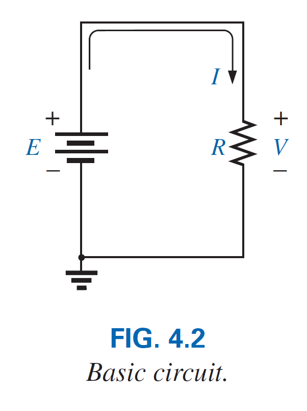

Para cualquier resistor, en cualquier red, la dirección de la corriente a travéz del resistor define la polaridad de la caida de voltaje a travez del resistor.

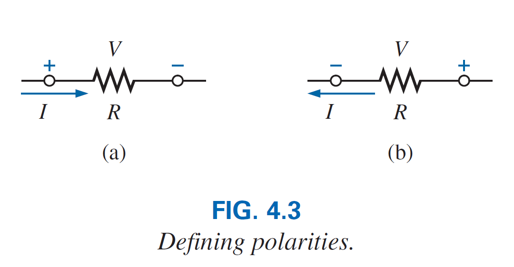