# ¿Qué es Arduino?

* Plataforma open-source (codigo abierto) para la creación de proyectos electrónicos mediante hardware y software.
* Tarjeta de Desarrollo basada en Microcontrolador.
* Se utiliza un Software de Desarrollo (Arduino IDE).
* Fácil de programar (C++ simplificado)
* Entradas/Salidas (sensores y actuadores)
* Gran cantidad de librerias disponibles
* En varias presentaciones: Arduino UNO el más popular.


## Placa de Arduino Uno

La arduino Uno es una placa de desarrollo basada en un microcontrolador Atmega328. Tiene 14 pines de entrada/salida digital (de los cuales 4 pueden ser utilizados para salidas PWM), 6 entradas análogas, un resonador cerámico de 16 MHz, un conector para USB tipo hembra, un Jack para fuente de Poder, un conector ICSP y un botón reset.

**Características técnicas:**

|Placa de desarrollo|ARDUINO UNO|
|------------------|------------------|
| Microcontrolador | ATmega328P       |
| Tensión de funcionamiento | 5V               |
| Voltaje de entrada (recomendado) | 7-12V            |
| Voltaje de entrada (límite) | 6-20V            |
| Digital pines I/O | 14 (de los cuales 6 proporcionan una salida PWM) |
| PWM digital pines I/O | 6                |
| Pines de entrada analógica | 6                |
| Corriente DC por Pin I/O | 20mA             |
| Corriente DC para Pin 3.3V | 60mA             |
| Memoria flash    | 32KB ATmega328P de los que 0,5 KB son utilizados por el gestor de arranque |
| SRAM             | 2KB ATmega328P   |
| EEPROM           | 1KB ATmega328P   |
| Velocidad de reloj | 16 MHz           |
| Longitud         | 68,6 mm          |
| Anchura          | 53,4 mm          |
| Peso             | 25 g             |

**Diagrama de pines**

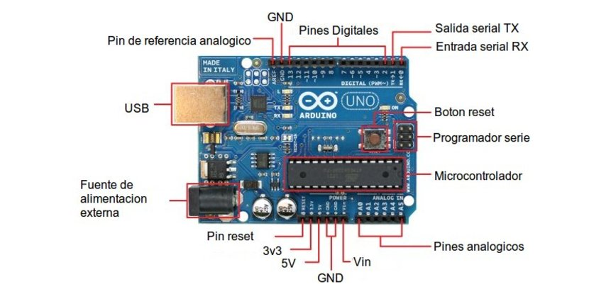

**Diagrama de completo**

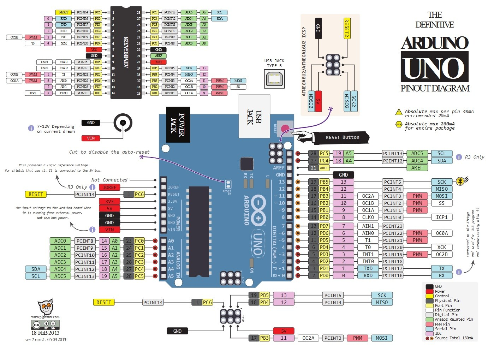

# Programación de Arduino

##  Preparación

* Descargar e Instalar el Software [Arduino IDE ](https://www.arduino.cc/en/Main/Software)
* Conectar el Arduino con el cable USB
* Instalar drivers (si fuera necesario)
* Verificar la conexión de placa con el Arduino IDE

## Uso de Salidas Digitales

En esta sesión vamos a aprender a crear el circuito y programa básico de Arduino. El "Hola Mundo" de la electrónica, el cual consiste en encender y apagar el LED integrado que trae la placa Arduino.

### EJEMPLO 1

#### Conexión

En este caso no necesitamos conexión ya que el LED que vamos a encender y apagar viene integrado en la placa Arduino, y conrresponde con el pin 13.

#### Simulación en  Tinkercad

Tinkercad nos permite simular la conexión del Arduino, y crear "programas" mediante la union bloques, lo cual es de mucha ayuda si usted no tiene experiencia en programación, ya que nos permite comprender de mejor manera la "logica" de un programa.

NOTA: *Se recomienda colocar el idioma en ingles, ya que las traducciones de los bloques suelen ser un poco confusas.*

Este es el "Hola Mundo" en bloques, para encender y apagar de forma intermitente el LED integrado que viene incluido en la placa de Arduino UNO

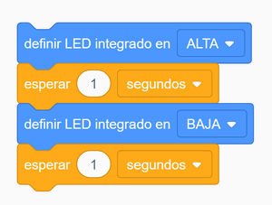

#### Codigo

Este sería el equivalente en código Arduino, el cual podemos guardar y cargar en nuestra placa real,

```cpp
void setup()
{
  pinMode(13, OUTPUT); //definimos el pin 13 como salida, en este pin se encuentra el LED_INTEGRADO
}

void loop()
{
  digitalWrite(13, HIGH); //encendemos el LED INTEGRADO
  delay(1000); // esperamos 1000 millisecond(s)
  digitalWrite(13, LOW); //apagamos el LED INTEGRADO
  delay(1000); // esperamos 1000 millisecond(s)
}
```

#### Resultado

Aqui vemos el led integrado parpadeando


### EJEMPLO 2: 

Ahora vamos a modificar el ejemplo anterior, pero vamos a cambiar el LED hacia el pin 10. Para esto debemos de cablearlo utilizando el protoboard y una resistencia de al menos 220ohm.

> **RECUERDE, SIEMPRE UTILIZAR UNA RESISTENCIA CUANDO CONECTE UN LED A UNA SALIDA DE ARDUINO, EL NO HACERLO PUEDE DAÑAR LA PLACA ARDUINO Y EL LED.**


#### Conexión

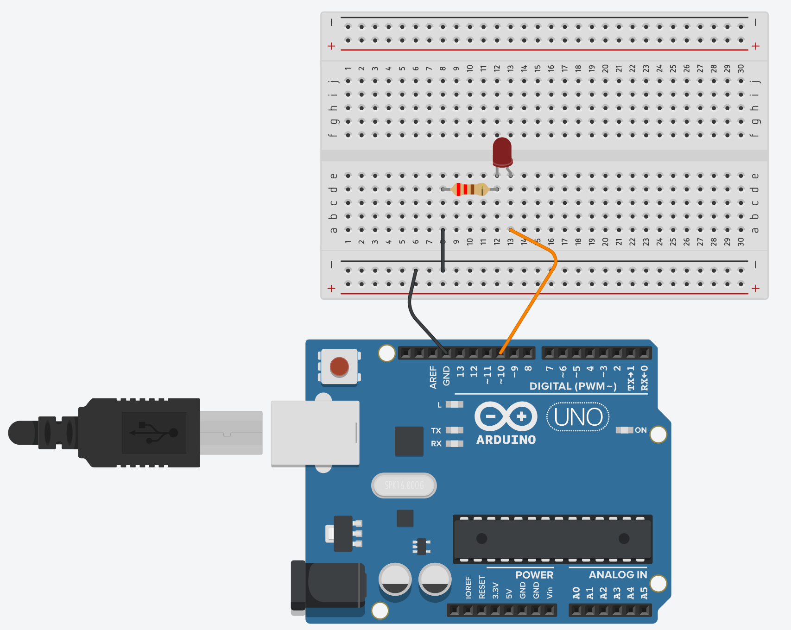

#### Programa (Bloques)

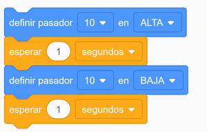

#### Programa (Codigo)

```c++
//Ejemplo salidas digitales -  Hola Mundo

// La rutina setup se ejecuta cuando encendemos el Arduino, 
// o presionamos el boton de reset:
void setup() {
  pinMode(10, OUTPUT); // inicializa el pin 10 como SALIDA (OUTPUT)
}

//La rutina loop se ejecuta una y otra vez, de forma infinita:
void loop() {
  digitalWrite(10, HIGH);   // Enciente el LED (voltaje HIGH)
  delay(1000);               // espera un segundo
  digitalWrite(10, LOW);    // Apaga el LED (voltaje LOW)
  delay(1000);               // espera un segundo
}

```

Como podemos ver en el codigo, la instrucción para "encender" o "apagar " una salida digital en Arduino es `digitalWrite()`.

La instrucción `delay()` nos permite hacer una pausa en el programa para que podamos notar el encendido y apagado del LED, en este caso es de 1000 milisegundos que es igual a 1 segundo.

#### Resultado


### RETO No. 1
Modificar el codigo para que la luz se encienda por 100 milisegundos y se apage por 900 milisegundos. Con esto creamos un temporizador de 1 segundo.

### RETO No. 2
Crear un circuito y programa que encienda y apague dos led de forma alterna, es decir; enciende el primero, apaga el segundo, apaga el primero, enciende el segundo, sucesivamente.

### RETO No. 3
Crear el circuito y programa para hacer un semaforo, debe de permanecer en verde, luego parpadear 5 veces antes de pasar a amarillo, y luego pasar a rojo, luego iniciar la secuencia nuevamente. 

### RETO No. 4
Con varios LEDS, crear el efecto "Kit El Auto fantastico"


---

## Uso Entradas Digitales

### Ejemplo # 1

En esta sección, veremos como utilizar un boton pulsador como entrada digital para encender un LED, mientras este se mantenga presionado.

### Conexión

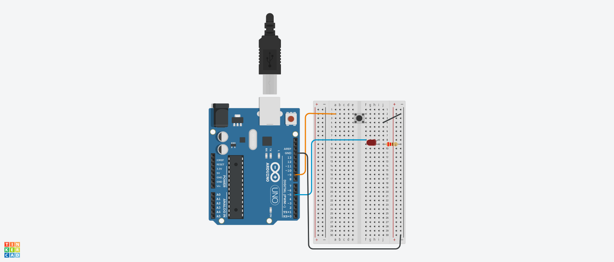

### Codigo

```cpp

int pinBoton=9;
int pinLed=5;

void setup()
{
  pinMode(pinBoton, INPUT_PULLUP); //pin conectado al boton
  pinMode(pinLed, OUTPUT); //led

}

void loop()
{
  if (digitalRead(pinBoton) == LOW) //si se presiono el boton
  {
     digitalWrite(pinLed,HIGH); //enciende el led
     delay(50); //delay para evitar rebotes con el boton
  
  }else
  {
    digitalWrite(pinLed,LOW);    
  }
}
```

La primera parte del sketch define dos variables para los dos pines que se va a utilizar. El 'pinLed' es un pin de salida y el 'pinBoton" se refiere al pulsador.

La función 'setup' define el pinBoton como una SALIDA, pero ahora tenemos una entradas que manejar. En este caso, utilizamos el pinMode como 'INPUT_PULLUP' según se muestra aqui:

```cpp
pinMode(pinBoton, INPUT_PULLUP); //pin conectado al boton
```
El modo de pin INPUT_PULLUP significa que el pin será utilizado como entrada, pero ademas le indica al Arduino que conecte internamente el pin con una resistencia de "pull-up", es decir que si no hay nada conectado a la entrada, este se conectara a VCC, por lo que recibirá un estado HIGH. cuando se presione el boton, el Arduino recibirá un estado LOW.

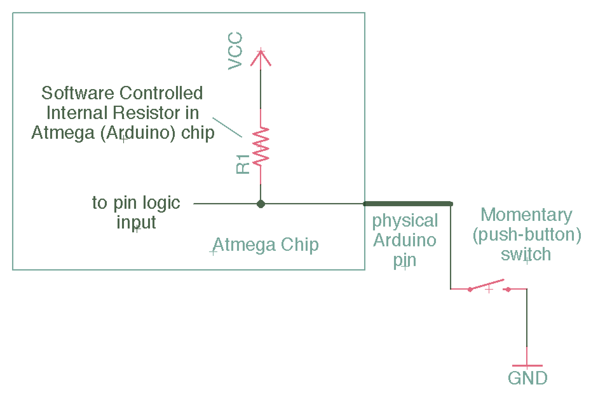

Esto lo debemo hacer cada vez que conectemos un boton a GND.

Debido a que la entrada es normalmente HIGH, y unicamente se cambia a LOW cuando el boton esta presionado, la logica que manejaremos en el boton sera "alreves".

### Ejemplo # 2:

Vamos a modificar el programa anterior para que al presionar el boton, el LED cambie de  estado, es decir, si el LED esta encendido que se apague, y si el LEDesta apagado que se encienda

### Conexión

La conexión es la misma que el ejemplo anterior

### Código

```cpp
boolean led_activo = false; //variable que nos servira para registra el estado del LED

void setup()
{
  pinMode(9, INPUT_PULLUP); //pin conectado al boton
  pinMode(5, OUTPUT); // pin conectado al LED
  digitalWrite (5, LOW); //inicializamos el LED en estado apagado
  led_activo=false; //iniciamos la variable de control el false, porque el led se inicia apagado
}

void loop()
{
  if (digitalRead(9) == LOW) //si se ha presionado el boton, entonces:
  {
    if (led_activo) //verificamos si el led esta encendido, mediante la variable de control
    {
      digitalWrite(5, LOW); //
      led_activo = false;
   
    }else
    {
      digitalWrite(5,HIGH);
    	led_activo=true;

  	}
  }
 
  delay(10);
}
```

## Uso de Entradas Analógicas

PENDIENTE ACTUALIZAR


## Uso de Salidas Analógicas

PENDIENTE ACTUALIZAR


## Ejercicio indicador de volumen


```cpp
// the setup routine runs once when you press reset:
void setup() {
  // initialize serial communication at 9600 bits per second:
  Serial.begin(9600);
   pinMode(10,OUTPUT); //pin con salida PWM para controlar brillo de LED
    pinMode(5,OUTPUT); 
    pinMode(6,OUTPUT); 
    pinMode(7,OUTPUT); 
}

// the loop routine runs over and over again forever:
void loop() {
  // read the input on analog pin 0:
  int sensorValue = analogRead(A0);
  // print out the value you read:
  Serial.println(sensorValue);
  sensorValue=(sensorValue+1)/4; // cambio de escala de 0 a 255
  analogWrite(10,sensorValue);

  if (sensorValue<=60) {
    digitalWrite(5,LOW);
    digitalWrite(6,LOW);
    digitalWrite(7,LOW);
   }else{
      if (sensorValue<=120){
        digitalWrite(5,HIGH);
        digitalWrite(6,LOW);
        digitalWrite(7,LOW);
       }else{
          if (sensorValue<=180){
              digitalWrite(5,HIGH);
              digitalWrite(6,HIGH);
              digitalWrite(7,LOW);
           }else{
              digitalWrite(5,HIGH);
              digitalWrite(6,HIGH);
              digitalWrite(7,HIGH);
           }
       }
    }
 
  delay(10);        // delay in between reads for stability
}
```


## Comunicacion Serial Con Arduino

### Envio de Datos desde Arduino

#### Ejemplo 1: Envio de una cadena de texto

Realizar un programa que envíe el texto "Hola Mundo" cuando se presione un boton

#### Ejercicio 2

Realizar un programa que vaya incrementando un número hasta llegar a 10 y lo envie por el puerto serie, por ejemplo, la primera vez que presiones debe enviar uno 1, la segunda vez debe enviar un 2, y sucesivamente.

#### Ejercicio 3

Modificar el programa anterior, para que al llegar el contador a 10, envíe un mensaje y reinicie el contador a 0.

---

### Recepcion de datos del Arduino

#### Ejemplo 1

Lectura de un caracter por el Arduino, lo desplegamos como **caracter** y como **entero**.

Los datos que enviamos desde la PC hacia el Arduino se envían en codigo ASCII.

```cpp
void setup()
{
  Serial.begin(9600);
  Serial.setTimeout(50);
}

void loop()
{
  if (Serial.available())
  {
    char data = Serial.read();
    Serial.print("Tu me enviaste un caracter: ");
    Serial.print(data);
    Serial.print(" cuyo codigo ASCII es: ");
    Serial.println((int)data);
  }
}
```

### Ejercicios

Basado en el ejemplo, realize los siguientes ejercicios:

#### Reto No. 1

Hacer un programa que al recibir un caracter "a" encienda un LED, y al recibir una "b" apague el LED

#### Reto No. 2

Hacer un programa que haga parpadear un LED a 3 *velocidades* diferentes
- Cuando reciba una "q", parpadea *despacio*.
- Cuando reciba una "w", parpadea *medio*.
- Cuando reciba una "e", parpadea *rapido*.
EXTRA: cuando reciba una "x", que deje de parpadear.

#### Reto No. 3

Hacer un programa que al recibir un numero 1 al 9, lo multiplique por 100 y me devuelva el resultado. Si se recibe un caracter diferente, devuelva un mensaje de error.

#### Reto No. 4

Hacer un programa que al recibir un número del 1 al 7, calcule el FACTORIAL y devuelva el resultado, si se recibe un caracter diferente, devuelva un mensaje de error.
EXTRA: modificar el programa para que pueda recibir del 1 al 9, calcular el factoria.
 
**Codigo solucion del reto 4**


```cpp
//calculo de factorial utilizando funciones

void setup()
{
  Serial.begin(9600);
}

//funcion que calcula el factorial de un caractar
long calculo_factorial(char  c)
{
 int n = (int)c - 48;
 long f = n ;
 for (int i = 1; i <= (n-1); i++) {
      f = f * i;
 }
 return f;
}

void loop()
{
  if (Serial.available())
  {
    char data = Serial.read();
    Serial.print("Tu me enviaste un caracter: ");
    Serial.print(data);
    Serial.print(" cuyo codigo ASCII es: ");
    Serial.println((int)data);
         
    Serial.print("El Factorial de ");
    Serial.print((int)data - 48);
    Serial.print(" es: ");
    Serial.println(calculo_factorial(data)); 
    
    Serial.print("Y el factorial de ");
    Serial.print(((int)data - 48)+1);
    Serial.print(" es: ");
    Serial.println(calculo_factorial(data+1)); 
    Serial.println(data +1)
    
  }
}
```

#### Reto No. 5

Ejercicio
Hacer un programa que reciba dos numeros y devuelva la suma, utilizando funciones, por ejemplo, debe de funcionar asi:

```plaintext
ingrese el primer numero:
4
ingrese el segundo numero:
5
la suma de 4 + 5 es:
9
```

#### Ejemplo 2

Recepción de un numero de varios digitos. En este ejemplo se utiliza la funcion `Serial.parseInt();` para leer un numero por el puerto serial, el cual puede ser tipo long, es decir hasta 2,147,483,647. 
```cpp
//EJEMPLO: RECIBIR UN NUMERO DE VARIOS DIGITOS

void setup()
{
  Serial.begin(9600);
 Serial.setTimeout(50);
}

void loop()
{
  if (Serial.available())
  {
    int data = Serial.parseInt();
    Serial.print("El numero recibido es ");
	Serial.println(data);
    data = data + 1;
    Serial.print("y es siguiente numero es ");
	Serial.println(data);   
  }
}
```
--
# Uso de Display LCD 16x2 con Arduino

Para controlar una pantalla LCD Arduino, se debe utilizar la libreria llamada LiquidCrystal, la cual nos permite controlar los display LCD que son compatibls con el driver Hitachi HD44780. Generalmente estas traen una interfaz de 16 pines.

En este sketch de ejemplo, se muestra como imprimir "Hola Mundo" en la LCD, y se muestra el tiempo en segundos desde que el Arduino fue reiniciado.

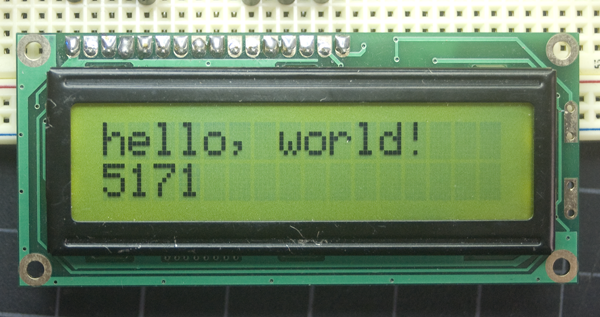v

Las LCD tienen una interfaz paralela, lo que significa que el microcontrolador tiene que manipular varios pines de la interfaz al mismo tiempo para controlar el display. La interfaz consiste en los siguientes pines:


**RegisteReSelect (RS):** este pin controla en que parte de la memoria de la LCD se escriben los datos. Se puede seleccionar ya sea los registros de datos, lo cual guarda lo que se muestra en la pantalla, o el registro de instrucciones, el cual guarda las instrucciones que debe realizar el controlador de la LCD.

**Read/Write (R/W):** con este pin se selecciona el modo lectura o escritura.

**Enable:** este pin habilita la escritura en los registros.

**8 pines de datos (D0 -D7):** El estado de estos pines (alto o bajo) son los valores de los bits que se escriben en el registro al momento  de escribir, asi como los valores que se leen al momento de leer.

Tambien hay un pin de **Contraste del display (Vo)**, pines de **alimentacion**, y pines **energia del LED de la luz de fondo**,pin para **controlar el contraste** del display, y para **encender o apagar el led** de fondo respectivamente.

El proceso de controlar el display consiste en colcoar los datos que forman la imagen que queremos desplegar en los registros de datos, y luego poner las instrucciones en el registro de instrucciones. La libreria LiquiedCrystal simplifica este proceso, para no tener que conocer las instrucciones de bajo nivel. 

Las LCD compatibles con el driver Hitachi pueden ser controladas en dos modos: 4-bits y 8-bits. El modo 4-bit requiere 7 pines E/S del Arduino, mientras el modo 8 bits requiere 11 pines. Para desplegar el texto en la pantalla, se puede hacer casi todo en el modo 4-bits, por lo que el ejemplo muestra como controlar una pantalla 16x2 en modo 4-bits.

### Material requerido

* Placa Arduino o Genuino
* Pantalla LCD  (compatible con el drier Hitachi HD44780)
* Potenciometro de 10k ohm
* Resistencia de 220 ohm
* Jumpers
* Protoboard

### Conexión del circuito

La conexión de va de la siguiente manera:

* pin RS de la LCD al pin digital 12 del Arduino
* pin Enable de la LCD al pin digital 11 del Arduino
* pin D4 de la LCD al pin digital 5 del Arduino
* pin D5 de la LCD al pin digital 4 del Arduino
* pin D6 de la LCD al pin digital 3 del Arduino
* pin D7 de la LCD al pin digital 2 del Arduino

Adicionalmente se debe cablear un potenciometro de 1Kohm a +5V y GND, y la salida de este al pin VO de la LCD (pin 3). 

Conectar el LED de la luz de fondo (pin 15 y 16) con una resistencia de 220ohm para proteger el LED.

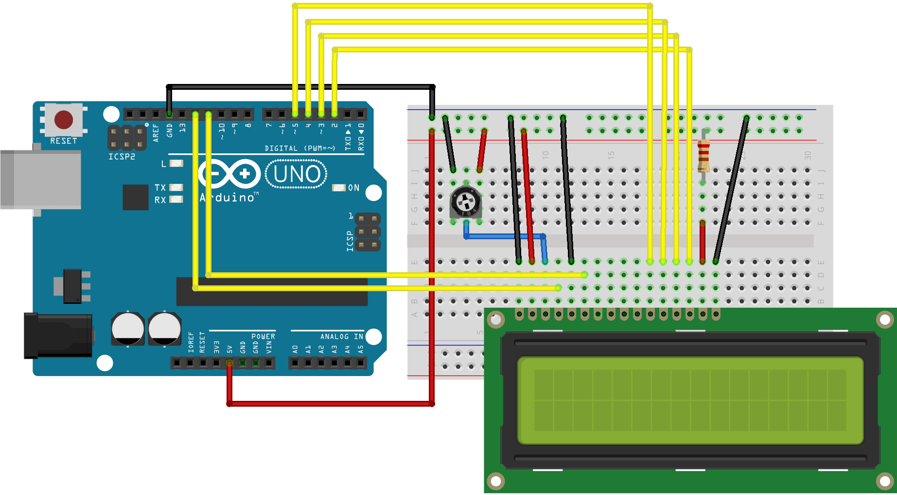

### Esquematico

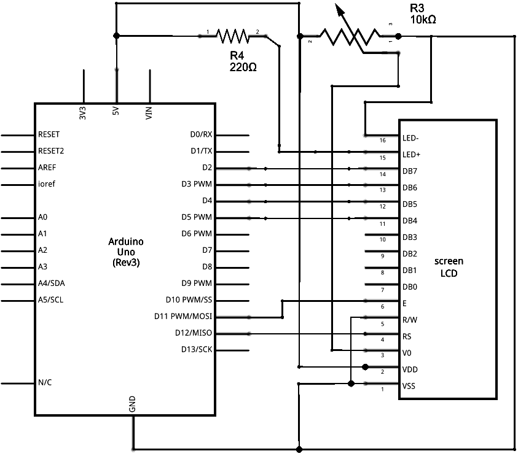

### Codigo

```cpp
/*
  LiquidCrystal Library - Hello World

 Demonstrates the use a 16x2 LCD display.  The LiquidCrystal
 library works with all LCD displays that are compatible with the
 Hitachi HD44780 driver. There are many of them out there, and you
 can usually tell them by the 16-pin interface.

 This sketch prints "Hello World!" to the LCD
 and shows the time.

  The circuit:
 * LCD RS pin to digital pin 12
 * LCD Enable pin to digital pin 11
 * LCD D4 pin to digital pin 5
 * LCD D5 pin to digital pin 4
 * LCD D6 pin to digital pin 3
 * LCD D7 pin to digital pin 2
 * LCD R/W pin to ground
 * LCD VSS pin to ground
 * LCD VCC pin to 5V
 * 10K resistor:
 * ends to +5V and ground
 * wiper to LCD VO pin (pin 3)

 Library originally added 18 Apr 2008
 by David A. Mellis
 library modified 5 Jul 2009
 by Limor Fried (http://www.ladyada.net)
 example added 9 Jul 2009
 by Tom Igoe
 modified 22 Nov 2010
 by Tom Igoe

 This example code is in the public domain.

 http://www.arduino.cc/en/Tutorial/LiquidCrystal
 */

// include the library code:
#include <LiquidCrystal.h>

// initialize the library with the numbers of the interface pins
LiquidCrystal lcd(12, 11, 5, 4, 3, 2);

void setup() {
  // set up the LCD's number of columns and rows:
  lcd.begin(16, 2);
  // Print a message to the LCD.
  lcd.print("hola, mundo!");
}

void loop() {
  // set the cursor to column 0, line 1
  // (note: line 1 is the second row, since counting begins with 0):
  lcd.setCursor(0, 1);
  // print the number of seconds since reset:
  lcd.print(millis() / 1000);
}
```

### Libreria

Enlace a la libreria <a href="https://www.arduino.cc/en/Reference/LiquidCrystal" target="_blank">LiquidCrystal.h</a>

--- 
# Arduino: Fotocelda

Una fotocelda o fotoresistencia, como su nombre lo dice, varía su valor según la luz que recibe. El valor de resistencia es muy alto en la oscuridad y puede llegar hasta 150 Ω en plena luz.

Para poder convertir este valor de resistencia variable de modo que podamos medirlo con Arduino, debemos convertirlo a un voltaje. Esto lo podemos hacer en combinación con una resistencia de valor fijo. 

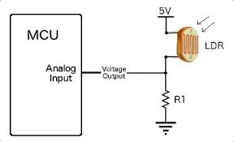

La resistencia y la fotocelda en conjunto actúan como un potenciómetro. Cuando la luz es muy alta, la resistencia en la fotocelda es muy baja comparada con el valor de la resistencia fija, lo que es similar a que si un potenciómetro estuviera en su valor máximo.

Cuando la fotocelda se encuentra en la oscuridad, la resistencia toma un valor alto comparado con la resistencia fija, lo que es similar a un potenciómetro girado a GND.

## EJEMPLO

### Conexion (Circuito)

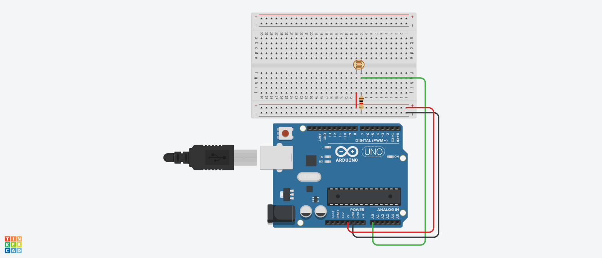


### Codigo

```cpp
void setup()
{
  pinMode(A0, INPUT);
  Serial.begin(9600);

}

void loop()
{
  Serial.println(analogRead(A0));
  delay(1000); // Wait for 1000 millisecond(s)
}
```

> ### Reto No. 1
> Cree un solución que active un LED cuando sea de noche, y lo apague cuando sea de día.

> ### Reto No. 2
> Crear un circuito que detecte tres niveles de luz (mañana, tarde y noche). Y cambie el color en un LED RGB de acuerdo a estos tres niveles.

---

# Arduino: Sensor Ultrasonico

Vamos a ver el sensor de distancia de tipo ultrasónico, el cual se conoce como HC-SR04.

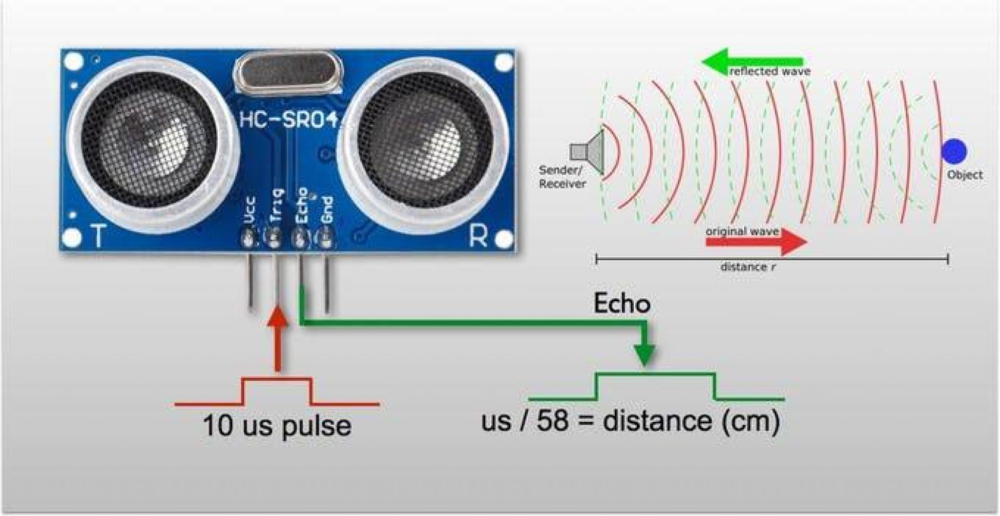

El sensor HC-SR04 utiliza 4 pines:
* VCC --> conectar 5VDC
* GND --> conectar GND
* TRIG --> conectar a una salida Digital
* ECHO --> conectar a una entrada Digital

Cuando el sensor recibe un pulso de 10 μs este realiza la medición de distancia y nos devuelve en el pin ECHO un pulso cuya duración es proporcional a la distancia medida.

## Ejemplo 

En este ejemplo vamos a aprender a utilizar librerías con Arduino.  Las librerías son muy útiles y nos permiten reutilizar codigo más complejo, lo cual nos facilita mucho el trabajo.  En este ejemplo vamos utilizar la librería **NewPing**, la cual se puede descargar [aqui](https://github.com/CarlosLRamirez/curso-intro-iot-arduino/blob/master/librerias/NewPing_v1.8.zip). 

Para inicializar el sensor, utilizamos el método constructor, indicando la entrada donde está cableado el pin de disparo, así como el de respuesta. El parámetro `max_cm_distance` es opcional. 

`NewPing sonar(trigger_pin, echo_pin [, max_cm_distance]);`

Para obtener la lectura de distancia del sensor en cm, utilizamos el metodo `sonar.ping_cm()`.

### Conexión

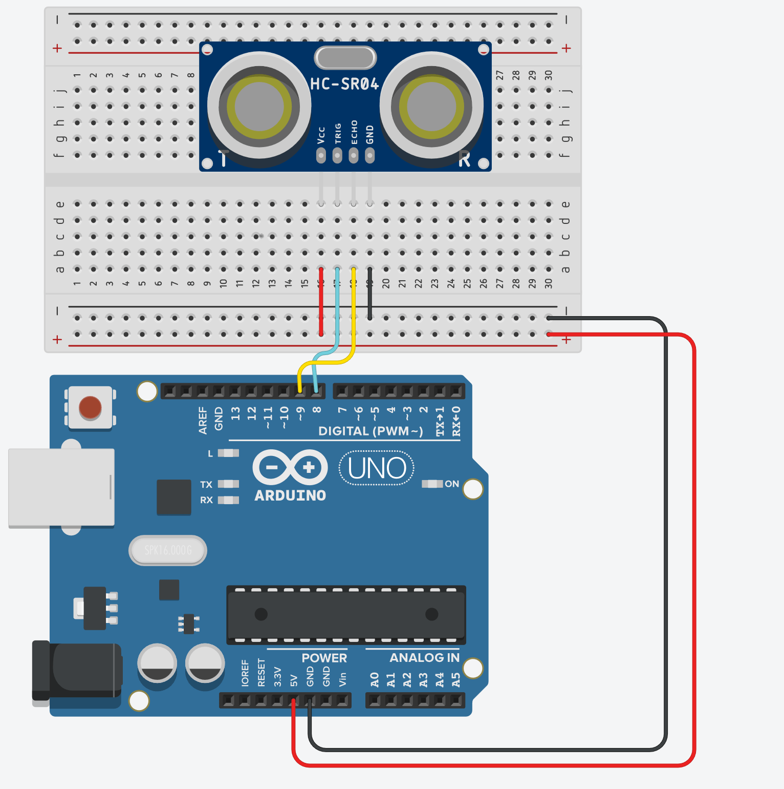

### Codigo

```cpp
/*
Codigo Ejemplo: Sensor Ultrasonica HC-SR04
Uso de la libreria NewPing
https://playground.arduino.cc/Code/NewPing/
*/

#include <NewPing.h>
 
#define PIN_DISPARO  8
#define PIN_RESPUESTA     9
#define DISTANCIA_MAX 200
 
NewPing sonar(PIN_DISPARO, PIN_RESPUESTA, DISTANCIA_MAX);
 
void setup() {
  Serial.begin(115200);
}
 
void loop() {
  delay(50);
  Serial.print("Ping: ");
  Serial.print(sonar.ping_cm());
  Serial.println("cm");
}
```
> 
> ## Reto No. 1
> Cree una solución que si detecta un objeto a menos de 20cm, encienda un LED.


> ## Reto No. 2
> Cree una solución que si detecta que un objeto esta a menos de 50cm, y durante al menos un minuto, encienda un LED.
>  
> 
> Y apague el LED, cuando ya no detecte el objeto por un minuto.

> ## Reto No. 3
> Cree una solución que pueda medir la longitud de los lados de una caja cuadrara y pueda calcular su área.


