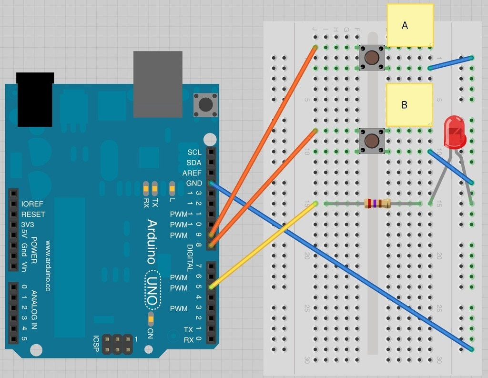

# ¿Qué es Arduino?

* Plataforma open-source (codigo abierto) para la creación de proyectos electrónicos mediante hardware y software.
* Tarjeta de Desarrollo basada en Microcontrolador.
* Se utiliza un Software de Desarrollo (Arduino IDE).
* Fácil de programar (C++ simplificado)
* Entradas/Salidas (sensores y actuadores)
* Gran cantidad de librerias disponibles
* En varias presentaciones: Arduino UNO el más popular.


## Placa de Arduino Uno

La arduino Uno es una placa de desarrollo basada en un microcontrolador Atmega328. Tiene 14 pines de entrada/salida digital (de los cuales 4 pueden ser utilizados para salidas PWM), 6 entradas análogas, un resonador cerámico de 16 MHz, un conector para USB tipo hembra, un Jack para fuente de Poder, un conector ICSP y un botón reset.

**Características técnicas:**

|Placa de desarrollo|ARDUINO UNO|
|------------------|------------------|
| Microcontrolador | ATmega328P       |
| Tensión de funcionamiento | 5V               |
| Voltaje de entrada (recomendado) | 7-12V            |
| Voltaje de entrada (límite) | 6-20V            |
| Digital pines I/O | 14 (de los cuales 6 proporcionan una salida PWM) |
| PWM digital pines I/O | 6                |
| Pines de entrada analógica | 6                |
| Corriente DC por Pin I/O | 20mA             |
| Corriente DC para Pin 3.3V | 60mA             |
| Memoria flash    | 32KB ATmega328P de los que 0,5 KB son utilizados por el gestor de arranque |
| SRAM             | 2KB ATmega328P   |
| EEPROM           | 1KB ATmega328P   |
| Velocidad de reloj | 16 MHz           |
| Longitud         | 68,6 mm          |
| Anchura          | 53,4 mm          |
| Peso             | 25 g             |

**Diagrama de pines**


**Diagrama de completo**


----

# Conceptos básicos de electrónica 

## El circuito eléctrico


## Voltaje, Corriente y Resistencia
    
**Voltaje** se define como la cantidad de energía potencial entre dos puntos de un circuito. Uno punto tiene más carga que otro. La diferencia de carga entre los puntos se llama voltaje. El voltaje de mide en Voltios (V).

**Corriente** es la tasa con la que fluye la carga. La corriente electrica se mide en Amperios (A).

**Resistencia** es la tendencia de resistir el flujo de carga (corriente) de un materialLa resistencia se mide en Ohms (Ω)


## La Ley de Ohm

El voltaje, la corriente y la resistencia estan relacionadas mediante la ley de Ohm


V= voltaje, I= corriente, R= resistencia

## Señal Digital Vs. Señal Analógica

Una señal Digital unicamente puede tener dos estados o dos valores, por ejemplo estos estados pueden ser "Encendido" o "Apagado", "Abierto" o  "Cerrado", "ON" o "OFF", "Verdadero" o "Falso", generalmente los representamos con los digitos 1 y 0, los cuales llamamos *bits*.

Una señal Analógica, puede tomar cualquier valor existente dentro de un rango determinado, por ejemplo son valores analógicos, la temperatura, el peso, la intensidad de la luz, la velocidad de un vehiculo, etc.


## Uso del Protoboard


## Codigo de colores de las Resistencias


---

# Introducción a Tinkercad

Tinkercad [(www.tinkercad.com)](www.tinkercad.com) es una herramienta en linea que nos permite la simulación de circuitos mediante la conexión de componentes electronicos virtuales,como protoboard, resistencia, leds, pulsadores, etc.

Tambien nos permite conectar y simular la programación de una placa Arduino UNO, como lo veremos mas adelante.

> **ACTIVIDAD**:
> 
> Crear un pequeño circuito eléctrico, utilizando un LED, una resistencia de 220 ohm, y un boton pulsador en serie, utilizaremos la placa de Arduino UNO unicamente como fuente de energía.
> 
> Calcular la corriente que pasa por el circuito, y luego medirla con un amperimetro y comparar ambos valores.
> 
> Simularlo en Tinkercad, y luego crearlo con componentes reales.
> 

---
# Programación de Arduino

##  Preparación

* Descargar e Instalar el Software [Arduino IDE ](https://www.arduino.cc/en/Main/Software)
* Conectar el Arduino con el cable USB
* Instalar drivers (si fuera necesario)
* Verificar la conexión de placa con el Arduino IDE

## Uso de Salidas Digitales

En esta sesión vamos a aprender a crear el circuito y programa básico de Arduino. El "Hola Mundo" de la electrónica, el cual consiste en encender y apagar el LED integrado que trae la placa Arduino.

### Conexión

En este caso no necesitamos conexión ya que el LED que vamos a encender y apagar viene integrado en la placa Arduino, y conrresponde con el pin 13.

### Simulación en  Tinkercad

Tinkercad nos permite simular la conexión del Arduino, y crear "programas" mediante la union bloques, lo cual es de mucha ayuda si usted no tiene experiencia en programación, ya que nos permite comprender de mejor manera la "logica" de un programa.

NOTA: *Se recomienda colocar el idioma en ingles, ya que las traducciones de los bloques suelen ser un poco confusas.*

Este es el "Hola Mundo" en bloques, para encender y apagar de forma intermitente el LED integrado que viene incluido en la placa de Arduino UNO


### Codigo

Este sería el equivalente en código Arduino, el cual podemos guardar y cargar en nuestra placa real,

```cpp
void setup()
{
  pinMode(13, OUTPUT);
}

void loop()
{
  digitalWrite(13, HIGH);
  delay(1000); // Wait for 1000 millisecond(s)
  digitalWrite(13, LOW);
  delay(1000); // Wait for 1000 millisecond(s)
}
```

### Resultado

Aqui vemos el led integrado parpadeando o "blinkeando"


## EJEMPLO 2-1: 

Parpadeo de un LED conectado a la pin 10, el cual lo podemos utilizar como una SALIDA DIGITAL.

### Conexión del circuito


### Programa (Bloques)


### Programa (Codigo)

```c++
//Ejemplo salidas digitales -  Hola Mundo

// La rutina setup se ejecuta cuando encendemos el Arduino, 
// o presionamos el boton de reset:
void setup() {
  // inicializa el pin 10 como SALIDA (OUTPUT)
  pinMode(10, OUTPUT);
}

//La rutina loop se ejecuta una y otra vez, de forma infinita:
void loop() {
  digitalWrite(10, HIGH);   // Enciente el LED (voltaje HIGH)
  delay(1000);               // espera un segundo
  digitalWrite(10, LOW);    // Apaga el LED (voltaje LOW)
  delay(1000);               // espera un segundo
}

```

Como podemos ver en el codigo, la instrucción para "encender" o "apagar " una salida digital en Arduino es `digitalWrite()`.

La instrucción `delay()` nos permite hacer una pausa en el programa para que podamos notar el encendido y apagado del LED, en este caso es de 1000 milisegundos que es igual a 1 segundo.

### Resultado


### RETO No. 1
Modificar el codigo para que la luz se encienda por 100 milisegundos y se apage por 900 milisegundos. Con esto creamos un temporizador de 1 segundo.

### RETO No. 2
Crear un circuito y programa que encienda y apague dos led de forma alterna, es decir; enciende el primero, apaga el segundo, apaga el primero, enciende el segundo, sucesivamente.

### RETO No. 3
Crear el circuito y programa para hacer un semaforo, debe de permanecer en verde, luego parpadear 5 veces antes de pasar a amarillo, y luego pasar a rojo, luego iniciar la secuencia nuevamente. 

### RETO No. 4
Con varios LEDS, crear el efecto "Kit El Auto fantastico"


# Arduino: Entradas Digitales

En esta sección, veremos como utilizar un boton pulsador como entrada digital para encender y apagerun LED.

Al presionar un boton pulsador el LED se debe encender, y al presionar el otro boton pulsador el LED se debe apagar.

## Conexión



## Codigo

```cpp
/*
Adafruit Arduino - Lesson 6. Inputs
*/

int ledPin = 5;
int buttonApin = 9;
int buttonBpin = 8;

byte leds = 0;

void setup() 
{
  pinMode(ledPin, OUTPUT);
  pinMode(buttonApin, INPUT_PULLUP);  
  pinMode(buttonBpin, INPUT_PULLUP);  
}

void loop() 
{
  if (digitalRead(buttonApin) == LOW)
  {
    digitalWrite(ledPin, HIGH);
  }
  if (digitalRead(buttonBpin) == LOW)
  {
    digitalWrite(ledPin, LOW);
  }
}
```

La primera parte del sketch define tres variables para los tres pins que se va a utilizar. El 'ledPin' es un pin de salida y el 'buttonApin" se refiere al pulsador de la parte de arriba del protoboard y el 'buttonBpin' se refiere al otro pulsador.

La función 'setup' define el ledPin como una SALIDA, pero ahora tenemos dos entradas que manejar. En este caso, utilizamos el pinMode como 'INPUT_PULLUP' según se muestra aqui:

```cpp
pinMode(buttonApin, INPUT_PULLUP);  
pinMode(buttonBpin, INPUT_PULLUP);
```
El modo de pin INPUT_PULLUP significa que el pin será utilizado como entrada, pero que si ningun otra cosa esta conectada a la entrada, esta deberia estar "tirada hacia arriba" (pulled-up) a HIGH (+5V). En otras palabras, el valor por defecto de la entrada es HIGH, mientras no sea "tirada hacia abajo" (pulled LOW) por la accion de presionar el boton.

Esta es la razón por la que los pulsadores estan conectados a GND. Cuando el pulsador es presionado, este conecta la entrada del pin a GND, por lo que cambia desde HIGH a LOW.

Debido a que la entrada es normalmente HIGH, y unicamente se cambia a LOW cuando el boton esta presionado, la logica esta un poco alreves. Esto se maneja en la funcion "loop".


> ### ACTIVIDAD 1:
> 
> Hacer un circuito que al presionar un boton, cambie el estado de un led, es decir, si el led esta encendido que lo apague, y si esta apagado que lo encienda:


#### CODIGO SOLUCION

```cpp
boolean led_activo = false;

void setup()
{
  pinMode(9, INPUT_PULLUP);
  pinMode(5, OUTPUT);
  pinMode(6, OUTPUT);
  digitalWrite (5, LOW);
  led_activo=false;
  
  
  
}

void loop()
{
  if (digitalRead(9) == LOW)
  {
    if (led_activo)
    {
      digitalWrite(5, LOW);
      led_activo = false;
   
    }else
    {
      digitalWrite(5,HIGH);
    	led_activo=true;

  	}
  }
 
  delay(10);
}
```
