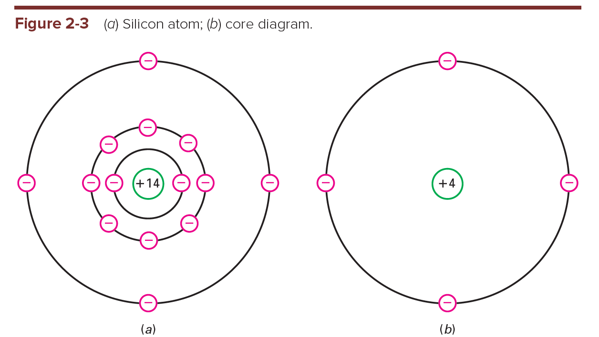
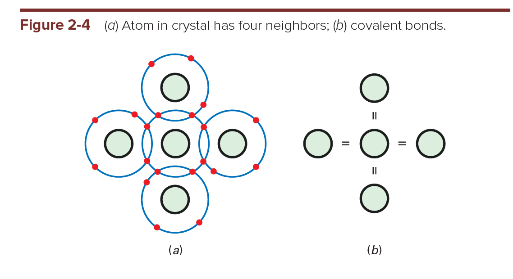
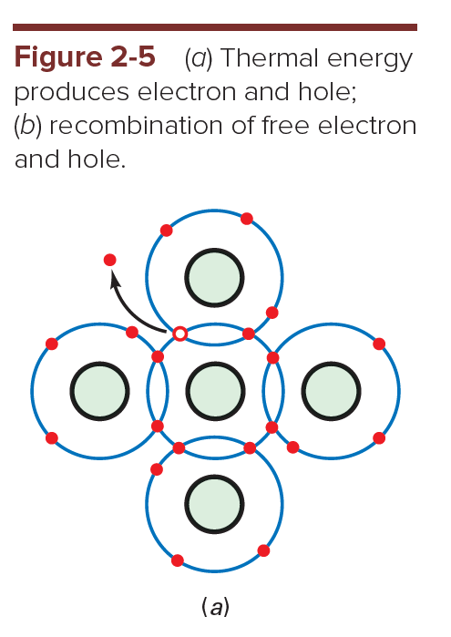
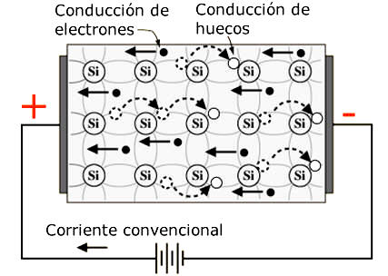
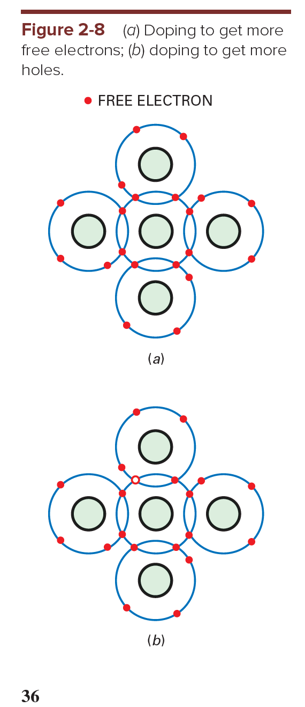

## Semiconductores

Los mejores conductores (plata, cobre y oro) tienen un electrón de valencia, mientras que los mejores aislantes tienen ocho electrones de valencia. Un semiconductor es un elemento con propiedades eléctricas entre las de un conductor y las de un aislante. Como es de esperar, los mejores semiconductores tienen cuatro electrones de valencia.

### Germanio

El germanio es un ejemplo de semiconductor. Tiene cuatro electrones en la órbita de valencia. Hace muchos años, el germanio era el único material adecuado para fabricar dispositivos semiconductores. Pero estos dispositivos de germanio tenían un error fatal (su corriente inversa excesiva, discutida en una sección posterior) que los ingenieros no pudieron superar. Finalmente, otro semiconductor llamado silicio se volvió práctico y dejó el germanio obsoleto en la mayoría de las aplicaciones electrónicas.

### Silicio
Junto al oxígeno, el silicio es el elemento más abundante en la tierra. Pero hubo ciertos problemas de refinación que impidieron el uso de silicio en los primeros días de los semiconductores. Una vez que se resolvieron estos problemas, las ventajas del silicio (discutido más adelante) lo convirtieron inmediatamente en el semiconductor de elección. Sin ella, la electrónica moderna, las comunicaciones y las computadoras serían imposibles.

## Cristales de silicio
Cuando los átomos de silicio se combinan para formar un sólido, se organizan en un patrón ordenado llamado cristal. Cada átomo de silicio comparte sus electrones con cuatro átomos vecinos de tal manera que tiene ocho electrones en su órbita de valencia. Por ejemplo, la figura 2-4a muestra un átomo central con cuatro vecinos. Los círculos sombreados representan los núcleos de silicio. Aunque el átomo central originalmente tenía cuatro electrones
en su órbita de valencia, ahora tiene ocho.

## Enlace covalente

Cada átomo vecino comparte un electrón con el átomo central. De esta manera, el átomo central tiene cuatro electrones adicionales, lo que le da un total de ocho electrones en la órbita de valencia. Los electrones ya no pertenecen a ningún átomo individual. Cada átomo central y sus vecinos comparten los electrones. La misma idea es cierta para todos los demás átomos de silicio. 

En otras palabras, cada átomo dentro de un cristal de silicio tiene cuatro vecinos.
En la figura 2-4a, cada núcleo tiene una carga de +4. Mire el núcleo central y el que está a su derecha. Estos dos núcleos atraen el par de electrones entre ellos con fuerza igual y opuesta. Esta atracción en direcciones opuestas es lo que mantiene unidos a los átomos de silicio. 

Dado que cada electrón compartido en la figura 2-4a se tira en direcciones opuestas, el electrón se convierte en un enlace entre los núcleos opuestos. Llamamos a este tipo de enlace químico un **enlace covalente**. La figura 2-4b es una forma más simple de mostrar el concepto de los enlaces covalentes. En un cristal de silicio, hay miles de millones de átomos de silicio, cada uno con ocho valencia electrones Estos electrones de valencia son los enlaces covalentes que mantienen unido el cristal, que le dan solidez.

## El agujero (hueco)
La temperatura ambiente es la temperatura del aire circundante. Cuando la temperatura ambiente está por encima del cero absoluto (2273 ° C), la energía térmica en este aire hace que los átomos en un cristal de silicio vibren. Cuanto mayor es la temperatura ambiente, más fuertes se vuelven las vibraciones mecánicas. Cuando recoges un objeto cálido, el calor que sientes es el efecto de los átomos que vibran.

En un cristal de silicio, las vibraciones de los átomos ocasionalmente pueden desalojar un electrón de la órbita de valencia. Cuando esto sucede, el electrón liberado gana suficiente energía para entrar en una órbita más grande, como se muestra en la figura 2-5a. En esta órbita más grande, el electrón es un electrón libre.
Pero eso no es todo. La salida del electrón crea una vacante en la órbita de valencia llamada agujero (ver Fig. 2-5a). Este agujero se comporta como una carga positiva porque la pérdida del electrón produce un ion positivo. El agujero atraerá y capturará cualquier electrón en las inmediaciones. La existencia de agujeros es la diferencia crítica entre conductores y semiconductores. Los agujeros permiten a los semiconductores hacer todo tipo de cosas que son imposibles con los conductores.

A temperatura ambiente, la energía térmica produce solo unos pocos agujeros y electrones libres. Para aumentar el número de agujeros y electrones libres, es necesario dopar el cristal. Más se dice sobre esto en una sección posterior.

## Semiconductores intrínsecos
Un semiconductor intrínseco es un semiconductor puro. Un cristal de silicio es un semiconductor intrínseco si cada átomo en el cristal es un átomo de silicio. A temperatura ambiente, un cristal de silicio actúa como un aislante porque solo tiene unos pocos electrones libres y huecos producidos por la energía térmica.

# Dos tipos de flujo
La figura 2-7 muestra un semiconductor intrínseco. Tiene la misma cantidad de electrones y agujeros libres. Esto se debe a que la energía térmica produce electrones libres y huecos en pares. El voltaje aplicado forzará a los electrones libres a fluir a la izquierda y a los agujeros a fluir a la derecha. Cuando los electrones libres llegan al extremo izquierdo del cristal, ingresan al cable externo y fluyen al terminal positivo de la batería.

Por otro lado, los electrones libres en el terminal negativo de la batería fluirán hacia el extremo derecho del cristal. En este punto, ingresan al cristal y se recombinan con agujeros que llegan al extremo derecho del cristal. De esta manera, se produce un flujo constante de electrones y agujeros libres dentro del semiconductor. Tenga en cuenta que no hay flujo de agujeros fuera del semiconductor. 

En la figura 2-7, los electrones libres y los agujeros se mueven en direcciones opuestas. A partir de ahora, visualizaremos la corriente en un semiconductor como el efecto combinado de los dos tipos de flujo: el flujo de electrones libres en una dirección y el flujo de agujeros en la otra dirección. Los electrones y agujeros libres a menudo se llaman portadores porque transportan una carga de un lugar a otro

## Dopado de un semiconductor
Una forma de aumentar la conductividad de un semiconductor es mediante dopaje. Esto significa agregar átomos de impurezas a un cristal intrínseco para alterar su conductividad eléctrica. Un semiconductor dopado se llama semiconductor extrínseco.

### Aumentando los electrones libres
¿Cómo dopa un fabricante un cristal de silicio? El primer paso es fundir un cristal de silicio puro. Esto rompe los enlaces covalentes y cambia el silicio de sólido a líquido. Para aumentar el número de electrones libres, se agregan átomos pentavalentes al silicio fundido. Los átomos pentavalentes tienen cinco electrones en la órbita de valencia. Los ejemplos de átomos pentavalentes incluyen arsénico, antimonio y fósforo.

Debido a que estos materiales donarán un electrón adicional al cristal de silicio, a menudo se les conoce como impurezas de los donantes.

La figura 2-8a muestra cómo aparece el cristal de silicio dopado después de que se enfría y vuelve a formar su estructura cristalina sólida. Un átomo pentavalente está en el centro, rodeado por cuatro átomos de silicio. Como antes, los átomos vecinos comparten un electrón con el átomo central. Pero esta vez, queda un electrón extra.

Recuerde que cada átomo pentavalente tiene cinco electrones de valencia. Como solo ocho electrones pueden caber en la órbita de valencia, el electrón adicional permanece en una órbita más grande. En otras palabras, es un electrón libre.

Cada átomo pentavalente o donante en un cristal de silicio produce un electrón libre. Así es como un fabricante controla la conductividad de un semiconductor dopado.

Cuanta más impureza se agregue, mayor será la conductividad. De esta manera, un semiconductor puede estar ligeramente o muy dopado. Un semiconductor ligeramente dopado tiene una alta resistencia, mientras que un semiconductor muy dopado tiene una baja resistencia.

## Aumentando el número de agujeros
¿Cómo podemos dopar un cristal de silicio puro para obtener un exceso de agujeros? Al usar una impureza trivalente, uno cuyos átomos tienen solo tres electrones de valencia. Los ejemplos incluyen aluminio, boro y galio.

La figura 2-8b muestra un átomo trivalente en el centro. Está rodeado por cuatro átomos de silicio, cada uno de los cuales comparte uno de sus electrones de valencia. Como el átomo trivalente originalmente tenía solo tres electrones de valencia y cada vecino comparte un electrón, solo siete electrones están en la órbita de valencia. Esto significa que existe un agujero en la órbita de valencia de cada átomo trivalente. Un átomo trivalente también se llama átomo aceptor porque cada agujero que contribuye puede aceptar un electrón libre durante la recombinación

## Dos tipos de semiconductores extrínsecos
Un semiconductor se puede dopar para tener un exceso de electrones libres o un exceso de agujeros. Debido a esto, hay dos tipos de semiconductores dopados. 

### Semiconductor tipo n
El silicio que ha sido dopado con una impureza pentavalente se llama **semiconductor de tipo n**, donde el **n** significa negativo. La Figura 2-9 muestra un semiconductor de tipo n.
Dado que los electrones libres superan en número a los agujeros en un semiconductor de tipo n, los electrones libres se llaman **portadores mayoritarios** y los agujeros se llaman **portadores minoritarios**.

Debido al voltaje aplicado, *los electrones libres se mueven hacia la izquierda y los agujeros se mueven hacia la derecha*. Cuando un agujero llega al extremo derecho del cristal, uno de los electrones libres del circuito externo ingresa al semiconductor y se recombina con el agujero.

Los electrones libres mostrados en la Figura 2-9 fluyen hacia el extremo izquierdo del crystal, donde entran en el cable y fluyen hacia la terminal positiva de la bateria.

#p-Type Semiconductor
Silicon that has been doped with a trivalent impurity is called a p-type semiconductor,
where the p stands for positive. Figure 2-10 shows a p-type semiconductor.
Since holes outnumber free electrons, the holes are referred to as the majority
carriers and the free electrons are known as the minority carriers.
Because of the applied voltage, the free electrons move to the left and
the holes move to the right. In Fig. 2-10, the holes arriving at the right end of the
crystal will recombine with free electrons from the external circuit.
There is also a fl ow of minority carriers in Fig. 2-10. The free electrons
inside the semiconductor fl ow from right to left. Because there are so few minority
carriers, they have almost no effect in this circuit.